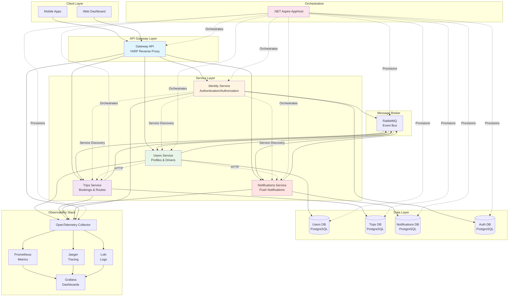

Masar Eagle is built as a cloud-native, event-driven microservices system orchestrated by .NET Aspire. It follows domain-driven design principles with clear service boundaries and asynchronous communication.

## Architecture Overview



## Core Components

### Gateway API

**Purpose:** Unified entry point for all client requests with routing and authentication

**Technology:** YARP (Yet Another Reverse Proxy)

**Key Features:**
- Reverse proxy with service discovery
- JWT token validation via JWKS
- Request/response logging
- CORS policy management
- Automatic header forwarding

**Code Highlight:**
```csharp
// From Gateway.Api/Program.cs:39
builder.Services.AddReverseProxy()
    .LoadFromConfig(builder.Configuration.GetSection("ReverseProxy"))
    .AddServiceDiscoveryDestinationResolver()
    .AddTransforms(context => context.AddXForwarded(ForwardedTransformActions.Set));
```

**Routes to:**
- `/users/*` → Users Service
- `/trips/*` → Trips Service
- `/notifications/*` → Notifications Service
- `/identity/*` → Identity Service

---

### Identity Service

**Purpose:** Centralized authentication and authorization

**Database:** `authdb` (PostgreSQL)

**Key Features:**
- User authentication with JWT tokens
- JWKS endpoint for token validation
- Identity key management with persistent storage
- Integration with Users service for profile data

**Dependencies:**
- PostgreSQL (auth database)
- RabbitMQ (event publishing)
- Users Service (HTTP)

**Code Highlight:**
```csharp
// From AppHost.cs:90
IResourceBuilder<ProjectResource> identityApi = builder.AddProject<Identity>(Services.Identity)
    .WithReference(authDb)
    .WithReference(usersDb)
    .WithReference(rabbitmq)
    .WithEnvironment("IDENTITY_KEYS_PATH", "/keys")
    .WithExternalHttpEndpoints();
```

---

### Users Service

**Purpose:** Manages user profiles, drivers, passengers, and file uploads

**Database:** `userdb` (PostgreSQL)

**Key Features:**
- User profile management (drivers, passengers, companies)
- File upload handling with local storage (`wwwroot`)
- Account purge background worker
- Integration with Trips service for usage tracking
- Response compression (Brotli/Gzip)
- Wolverine + RabbitMQ for messaging with PostgreSQL outbox pattern

**Dependencies:**
- PostgreSQL (users database)
- RabbitMQ (pub/sub messaging)
- Trips Service (HTTP - usage tracking)
- Notifications Service (HTTP)
- Identity Service (JWKS for authentication)

**Code Highlight:**
```csharp
// From Users.Api/Program.cs:116
await builder.UseWolverineWithRabbitMqAsync(
    new WolverineMessagingOptions
    {
        EnablePostgresOutbox = true,
        PostgresConnectionName = Components.Database.User,
        OutboxSchema = "wolverine"
    },
    opts =>
    {
        opts.PublishAllMessages().ToRabbitExchange(Components.RabbitMQConfig.ExchangeName);
        opts.ListenToRabbitQueue("users-api-queue",
            cfg => cfg.BindExchange(Components.RabbitMQConfig.ExchangeName));
    });
```

**Background Services:**
- `AccountPurgeWorker` - Periodic cleanup of inactive accounts

---

### Trips Service

**Purpose:** Core business logic for trip management, bookings, and payments

**Database:** `tripdb` (PostgreSQL)

**Key Features:**
- Trip creation and management (driver trips, company trips)
- Seat booking and passenger reservations
- Unified search (driver trips + company trips)
- Payment integration with Moyasar
- Wallet operations and top-ups
- Booking transfers and cancellations
- Trip reminders with Hangfire scheduling
- Auto-cancellation of overdue trips
- GeoJSON support for routes

**Dependencies:**
- PostgreSQL (trips database)
- RabbitMQ (event-driven communication)
- Hangfire (background job scheduling)
- Users Service (HTTP - for user data)

**Code Highlight:**
```csharp
// From Trips.Api/Program.cs:115
builder.Services.AddHangfire(config => config
    .SetDataCompatibilityLevel(CompatibilityLevel.Version_180)
    .UseSimpleAssemblyNameTypeSerializer()
    .UseRecommendedSerializerSettings()
    .UseMemoryStorage());

builder.Services.AddHangfireServer(options =>
{
    options.Queues = ["default", "notifications"];
    options.WorkerCount = Environment.ProcessorCount * 5;
});
```

**Background Services:**
- `HangfireStartupService` - Configures recurring jobs
- Trip reminder scheduling
- Auto-cancellation of overdue trips

**Messaging:**
```csharp
// From Trips.Api/Program.cs:136
await builder.UseWolverineWithRabbitMqAsync(opts =>
{
    opts.PublishMessage<UploadFileCommand>().ToRabbitQueue("users-api-queue");
    opts.PublishMessage<UpdateDriverRatingCommand>().ToRabbitQueue("users-api-queue");
    opts.PublishMessage<UpdatePassengerRatingCommand>().ToRabbitQueue("users-api-queue");
    
    opts.Publish()
        .MessagesFromAssemblyContaining<DriverCreatedNotification>()
        .ToRabbitExchange(Components.RabbitMQConfig.ExchangeName);
    
    opts.ListenToRabbitQueue("trips-api-queue",
        cfg => cfg.BindExchange(Components.RabbitMQConfig.ExchangeName));
});
```

---

### Notifications Service

**Purpose:** Push notifications to mobile devices via Firebase Cloud Messaging

**Database:** `notificationsdb` (PostgreSQL)

**Key Features:**
- Firebase Cloud Messaging (FCM) integration
- Device token management
- Notification history tracking
- Event-driven notifications via RabbitMQ
- Integration with Users service for user data

**Dependencies:**
- PostgreSQL (notifications database)
- RabbitMQ (event subscription)
- Users Service (HTTP)
- Firebase Cloud Messaging

**Code Highlight:**
```csharp
// From Notifications.Api/Program.cs:74
await builder.UseWolverineWithRabbitMqAsync(opts =>
{
    opts.ListenToRabbitQueue(Components.RabbitMQConfig.QueueName,
        cfg => cfg.BindExchange(Components.RabbitMQConfig.ExchangeName));
    opts.ApplicationAssembly = typeof(Program).Assembly;
});
```

**Event Handlers:**
- Trip creation notifications
- Booking confirmations
- Payment confirmations
- Trip reminders
- Cancellation alerts

---

## Technology Stack

<CardGroup cols={2}>
  <Card title="Runtime" icon="microsoft">
    **.NET 9**
    - Minimal APIs
    - Native AOT ready
    - High-performance runtime
  </Card>

  <Card title="Orchestration" icon="layer-group">
    **.NET Aspire**
    - Service orchestration
    - Service discovery
    - Resource management
    - Dashboard and monitoring
  </Card>

  <Card title="Database" icon="database">
    **PostgreSQL**
    - 4 separate databases
    - FluentMigrator for migrations
    - Npgsql driver
  </Card>

  <Card title="Message Broker" icon="exchange-alt">
    **RabbitMQ**
    - Event-driven communication
    - Pub/sub pattern
    - Message persistence
  </Card>

  <Card title="Messaging Framework" icon="wolf">
    **Wolverine**
    - .NET messaging framework
    - PostgreSQL outbox pattern
    - RabbitMQ integration
    - Transactional messaging
  </Card>

  <Card title="API Gateway" icon="network-wired">
    **YARP**
    - Reverse proxy
    - Dynamic routing
    - Service discovery
    - Load balancing
  </Card>

  <Card title="Authentication" icon="lock">
    **JWT + JWKS**
    - Token-based auth
    - Key discovery
    - Distributed validation
  </Card>

  <Card title="Validation" icon="check-circle">
    **FluentValidation**
    - Request validation
    - Complex rules
    - Composable validators
  </Card>

  <Card title="Scheduling" icon="clock">
    **Hangfire**
    - Background jobs
    - Recurring tasks
    - Trip reminders
    - Auto-cancellation
  </Card>

  <Card title="API Documentation" icon="book">
    **Swagger/OpenAPI**
    - Interactive documentation
    - Schema generation
    - Try-it-out functionality
  </Card>

  <Card title="Observability" icon="chart-line">
    **OpenTelemetry**
    - Distributed tracing
    - Metrics collection
    - Log aggregation
    - OTLP protocol
  </Card>

  <Card title="Push Notifications" icon="bell">
    **Firebase Cloud Messaging**
    - Mobile push notifications
    - Cross-platform support
    - Rich notifications
  </Card>
</CardGroup>

## Communication Patterns

### Synchronous (HTTP)

**Service Discovery:**
All HTTP communication uses Aspire's built-in service discovery:

```csharp
// From Users.Api/Program.cs:72
builder.Services.AddHttpClient<TripsUsageClient>("trip", 
    client => client.BaseAddress = new Uri("https+http://trip"))
    .AddServiceDiscovery();
```

The `https+http://` scheme tells Aspire to:
1. Discover the service endpoint
2. Try HTTPS first, fall back to HTTP
3. Handle load balancing automatically

**Direct HTTP Calls:**
- Users → Trips (usage tracking)
- Users → Notifications (send notifications)
- Notifications → Users (get user data)
- All Services → Identity (JWKS key discovery)

---

### Asynchronous (Event-Driven)

**Wolverine + RabbitMQ:**
All services use Wolverine for reliable, transactional messaging:

**Publishing Events:**
```csharp
// Services publish domain events
public class TripCreatedHandler : IWolverineHandler
{
    public async Task Handle(TripCreatedEvent evt, IMessageBus bus)
    {
        await bus.PublishAsync(new TripCreatedNotification
        {
            TripId = evt.TripId,
            DriverId = evt.DriverId
        });
    }
}
```

**Consuming Events:**
```csharp
// Notifications service listens for events
public class TripCreatedNotificationHandler : IWolverineHandler
{
    public async Task Handle(TripCreatedNotification notification)
    {
        // Send FCM notification to relevant users
    }
}
```

**Exchange Configuration:**
```csharp
// From BuildingBlocks/MasarEagle.Constants/Aspire/Components.cs:18
public static class RabbitMQConfig
{
    public static readonly string ExchangeName = "notifications";
    public static readonly string QueueName = "notifications";
}
```

**Benefits:**
- **Reliability:** PostgreSQL outbox pattern ensures no message loss
- **Decoupling:** Services don't need to know about each other
- **Scalability:** Async processing doesn't block HTTP requests
- **Resilience:** Failed messages are automatically retried

---

## Database Architecture

### Database-per-Service Pattern

Each service owns its database with complete autonomy:

```csharp
// From AppHost.cs:9
IResourceBuilder<PostgresServerResource> postgres = builder.AddPostgres(Components.Postgres)
    .WithEnvironment("POSTGRES_HOST_AUTH_METHOD", "trust")
    .WithDataVolume(name: "masar-postgres-data", isReadOnly: false)
    .WithPgAdmin(pgAdmin => pgAdmin.WithHostPort(5050));

IResourceBuilder<PostgresDatabaseResource> usersDb = postgres.AddDatabase(Components.Database.User);
IResourceBuilder<PostgresDatabaseResource> tripsDb = postgres.AddDatabase(Components.Database.Trip);
IResourceBuilder<PostgresDatabaseResource> notificationsDb = postgres.AddDatabase(Components.Database.Notifications);
IResourceBuilder<PostgresDatabaseResource> authDb = postgres.AddDatabase(Components.Database.Auth);
```

**Database Names:**
- `userdb` - Users Service
- `tripdb` - Trips Service
- `notificationsdb` - Notifications Service
- `authdb` - Identity Service

**Migration Strategy:**
Each service manages its own migrations using FluentMigrator:

```csharp
// From Users.Api/Program.cs:62
builder.Services.AddDatabaseMigrations(
    builder.Configuration,
    Assembly.GetExecutingAssembly(),
    connectionStringName: Components.Database.User);
```

Migrations run automatically on service startup.

---

## Observability Stack

### OpenTelemetry Integration

All services export telemetry using the OTLP protocol:

```csharp
// From AppHost.cs:27
string otelEndpoint = "http://otelcollector:4317";

// Injected into each service:
WithEnvironment("OTEL_EXPORTER_OTLP_ENDPOINT", otelEndpoint)
WithEnvironment("OTEL_EXPORTER_OTLP_PROTOCOL", "grpc")
WithEnvironment("OTEL_SERVICE_NAME", "<service-name>")
```

### Telemetry Pipeline

```
Services → OpenTelemetry Collector → Prometheus (metrics)
                                   → Jaeger (traces)
                                   → Loki (logs)
                                   → Grafana (visualization)
```

**What's Collected:**

<CardGroup cols={3}>
  <Card title="Metrics" icon="gauge">
    - Request rates
    - Response times
    - Error rates
    - Resource usage (CPU, memory)
    - Custom business metrics
  </Card>

  <Card title="Traces" icon="route">
    - Request flow across services
    - Latency breakdown
    - Database query times
    - HTTP client calls
    - RabbitMQ message flow
  </Card>

  <Card title="Logs" icon="file-alt">
    - Structured logs
    - Correlation IDs
    - Exception details
    - Business events
    - Audit trails
  </Card>
</CardGroup>

**Service Defaults:**
```csharp
// From ServiceDefaults/Extensions.cs:16
public static TBuilder AddServiceDefaults<TBuilder>(this TBuilder builder)
{
    builder.ConfigureOpenTelemetry(); // Auto-configures OTel
    builder.AddDefaultHealthChecks();
    builder.Services.AddServiceDiscovery();
    builder.Services.ConfigureHttpClientDefaults(http =>
    {
        http.AddStandardResilienceHandler(); // Retry, timeout, circuit breaker
        http.AddServiceDiscovery();
    });
    return builder;
}
```

---

## Resilience Patterns

### HTTP Resilience

All HTTP clients include standard resilience handlers:

```csharp
// Automatic retry, timeout, and circuit breaker
http.AddStandardResilienceHandler();
```

**Policies:**
- **Retry:** Automatic retry with exponential backoff
- **Timeout:** Per-request and total timeout
- **Circuit Breaker:** Fail fast when service is down
- **Bulkhead:** Limit concurrent requests

### Messaging Resilience

**PostgreSQL Outbox Pattern:**
- Messages are first written to the database
- Published to RabbitMQ in a background process
- Guarantees message delivery even if RabbitMQ is down

**Dead Letter Queues:**
- Failed messages are moved to DLQ
- Can be reprocessed or analyzed

### Health Checks

All services expose health endpoints:

```csharp
// From ServiceDefaults/Extensions.cs:83
public static WebApplication MapDefaultEndpoints(this WebApplication app)
{
    app.MapHealthChecks("/health");
    app.MapHealthChecks("/alive", new HealthCheckOptions
    {
        Predicate = r => r.Tags.Contains("live")
    });
    return app;
}
```

Aspire monitors these endpoints and restarts unhealthy services.

---

## Service Dependencies

### Startup Order

Aspire manages service dependencies with `WaitFor()`:

```csharp
// From AppHost.cs:30
IResourceBuilder<ProjectResource> usersApi = builder.AddProject<User>(Services.User)
    .WithReference(usersDb)
    .WithReference(rabbitmq)
    .WithReference(tripsApi)
    .WaitFor(usersDb)        // Wait for database
    .WaitFor(otelCollector)  // Wait for observability
    .WaitFor(rabbitmq);      // Wait for message broker
```

**Dependency Graph:**

```
PostgreSQL ──┬──> Users Service ──┐
             ├──> Trips Service ───┤
             ├──> Notifications ───┼──> Gateway API
             └──> Identity Service ┘
                   ↑
RabbitMQ ──────────┤
                   ↑
OTel Collector ────┘
```

### Service References

**Identity References:**
All services reference Identity for JWKS:

```csharp
// From AppHost.cs:116
usersApi.WithReference(identityApi);
tripsApi.WithReference(identityApi);
notificationsApi.WithReference(identityApi);
```

This enables JWT token validation across all services.

---

## Configuration Management

### Aspire Configuration

All configuration flows through Aspire:

```csharp
// From AppHost.cs:18
IResourceBuilder<ParameterResource> username = builder.AddParameter("username", secret: true);
IResourceBuilder<ParameterResource> password = builder.AddParameter("password", secret: true);

IResourceBuilder<RabbitMQServerResource> rabbitmq = builder.AddRabbitMQ(
    Components.RabbitMQ, username, password);
```

**Parameter Sources:**
1. `appsettings.json` (development defaults)
2. Environment variables (overrides)
3. User secrets (local development)
4. Azure Key Vault (production)

### Environment-Specific Settings

```csharp
// From AppHost.cs:121
string gatewayEnvironment = builder.ExecutionContext.IsPublishMode 
    ? "Production" 
    : "Development";

gatewayApi.WithEnvironment("ASPNETCORE_ENVIRONMENT", gatewayEnvironment);
```

**Deployment Modes:**
- `dotnet run` → Development mode
- `aspire publish` → Production mode (generates docker-compose)

---

## Deployment Architecture

### Development (Aspire)

Development uses Aspire orchestration:

```bash
cd src/aspire/AppHost
dotnet run
```

Aspire provides:
- Service discovery
- Health monitoring
- Log aggregation
- Resource visualization
- Live reload

### Production (Docker Compose)

Production uses generated docker-compose files:

```bash
# Generate artifacts
./build-artifacts.sh prod

# Deploy to server
./deploy.sh prod
```

**Deployment Script (`deploy.sh:57`):**
```bash
docker compose -p "$COMPOSE_PROJECT_NAME" up -d --pull always --no-build
```

**Post-Deployment:**
- Initialize volumes for file storage
- Attach containers to npm-network (for reverse proxy)
- Run permission fixes for upload directories

---

## Security Considerations

<Warning>
The development environment uses insecure defaults for ease of use. Production deployments must address these security concerns.
</Warning>

### Development Security Issues

1. **Certificate Validation Disabled:**
   ```csharp
   // From Users.Api/Program.cs:76
   ServerCertificateCustomValidationCallback = 
       HttpClientHandler.DangerousAcceptAnyServerCertificateValidator
   ```

2. **CORS Allow All:**
   ```csharp
   // From Gateway.Api/Program.cs:26
   policy.AllowAnyOrigin().AllowAnyMethod().AllowAnyHeader()
   ```

3. **Default Credentials:**
   - RabbitMQ: `guest/guest`
   - PostgreSQL: Trust authentication

### Production Recommendations

- Use proper TLS certificates
- Configure specific CORS origins
- Use strong, unique passwords from Key Vault
- Enable PostgreSQL authentication
- Implement rate limiting
- Use API keys for service-to-service auth
- Enable network segmentation

---

## Next Steps

<CardGroup cols={2}>
  <Card title="Quickstart Guide" icon="rocket" href="/quickstart">
    Get the system running locally in minutes
  </Card>
  <Card title="Development Setup" icon="code" href="/development/building-blocks">
    Configure your development environment
  </Card>
  <Card title="API Reference" icon="book" href="/api/overview">
    Detailed API documentation for all services
  </Card>
  <Card title="Deployment Guide" icon="docker" href="/setup/docker-deployment">
    Deploy to production environments
  </Card>
</CardGroup>