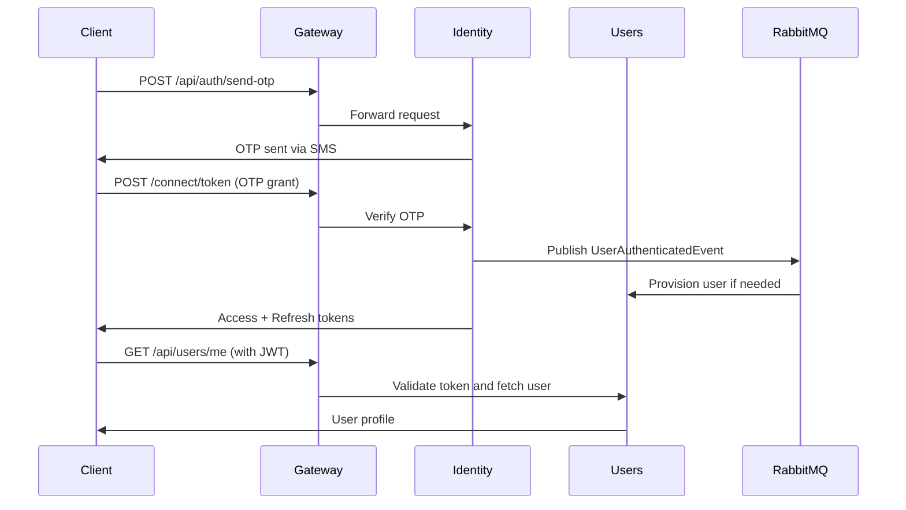

Masar Eagle implements a **standards-based authentication system** using **OpenID Connect** (via OpenIddict) with support for multiple authentication flows: phone-based OTP for drivers and passengers, password-based login for admins and companies, and refresh token rotation for long-lived sessions.

## Authentication Architecture



## OpenID Connect with OpenIddict

The Identity service uses **OpenIddict** to implement OpenID Connect:

```csharp src/services/Identity/src/Identity.Web/OpenIddictServerConfiguration.cs:16
services.AddOpenIddict()
    .AddServer(options =>
    {
        options.SetTokenEndpointUris("connect/token")
               .SetRevocationEndpointUris("connect/revocation")
               .SetIntrospectionEndpointUris("connect/introspect");

        options.AllowPasswordFlow()
               .AllowRefreshTokenFlow()
               .AllowCustomFlow("urn:masareagle:otp");  // Custom OTP grant

        options.SetIssuer(new Uri($"https://{jwt.Issuer}"));

        // Persistent RSA keys for token signing/encryption
        AddPersistentSigningKey(options);
        AddPersistentEncryptionKey(options);
        options.DisableAccessTokenEncryption();

        options.SetAccessTokenLifetime(TimeSpan.FromMinutes(jwt.AccessTokenExpiryMinutes));
        options.SetRefreshTokenLifetime(TimeSpan.FromDays(30));

        options.RegisterScopes(
            OpenIddictConstants.Scopes.OpenId,
            OpenIddictConstants.Scopes.OfflineAccess,
            OpenIddictConstants.Scopes.Profile,
            OpenIddictConstants.Scopes.Roles,
            "api");
    })
    .AddValidation(options =>
    {
        options.UseLocalServer();  // Validate tokens locally
        options.UseAspNetCore();
    });
```

<Info>
**Why OpenIddict?** It's a lightweight, standards-compliant OIDC implementation that supports custom grant types—perfect for mobile apps requiring OTP authentication.
</Info>

### Persistent Signing Keys

Tokens are signed with **persistent RSA keys** that survive restarts:

```csharp src/services/Identity/src/Identity.Web/OpenIddictServerConfiguration.cs:117
private static void AddPersistentSigningKey(OpenIddictServerBuilder options)
{
    Directory.CreateDirectory(KeysDirectory);
    var signingKeyPath = Path.Combine(KeysDirectory, "signing-key.pem");

    RSA rsa;
    if (File.Exists(signingKeyPath))
    {
        rsa = RSA.Create();
        rsa.ImportRSAPrivateKey(
            Convert.FromBase64String(File.ReadAllText(signingKeyPath)), out _);
    }
    else
    {
        rsa = RSA.Create(2048);
        var pem = Convert.ToBase64String(rsa.ExportRSAPrivateKey());
        File.WriteAllText(signingKeyPath, pem);
    }

    options.AddSigningKey(new RsaSecurityKey(rsa));
}
```

<Warning>
**Production Deployment**: Mount a persistent volume to `/keys` (configured via `IDENTITY_KEYS_PATH` environment variable) to ensure keys survive container restarts.
</Warning>

## Authentication Flows

### 1. OTP Flow (Driver/Passenger)

Phone-based authentication using one-time passwords:

<Steps>
  <Step title="Request OTP">
    Client sends phone number to request an OTP:
    
    ```bash
    POST /api/auth/send-otp
    Content-Type: application/json

    {
      "phoneNumber": "+966501234567",
      "userType": "driver"
    }
    ```
    
    The Identity service generates a 6-digit code and sends it via SMS.
  </Step>
  
  <Step title="Submit OTP">
    Client submits the OTP code to the token endpoint:
    
    ```bash
    POST /connect/token
    Content-Type: application/x-www-form-urlencoded

    grant_type=urn:masareagle:otp&
    phone_number=+966501234567&
    otp_code=123456&
    user_type=driver
    ```
  </Step>
  
  <Step title="Verify OTP">
    The Identity service verifies the OTP code:
    
    ```csharp src/services/Identity/src/Identity.Web/TokenEndpoint.cs:87
    private static async Task<IResult> VerifyOtpCode(
        PhoneNumber phone,
        string code,
        string userType,
        IOtpService otpService,
        IUserPhoneResolver phoneResolver,
        IMessageBus messageBus)
    {
        var otpResult = await otpService.VerifyOtpAsync(phone.Value, code);

        if (otpResult.Status != ResultStatus.Ok)
        {
            return ForbidWithError(Errors.InvalidGrant, 
                string.Join("; ", otpResult.Errors));
        }

        // Publish event to ensure user is provisioned
        await messageBus.PublishAsync(
            new UserAuthenticatedEvent(phone.Value, userType, phone.Value));

        var userIdResult = await phoneResolver.ResolveUserIdAsync(phone.Value, userType);

        return await SignInAndPublish(userIdResult.Value, userType, phone.Value, messageBus);
    }
    ```
  </Step>
  
  <Step title="Issue Tokens">
    Upon successful verification, the service issues tokens:
    
    ```json
    {
      "access_token": "eyJhbGciOiJSUzI1NiIsInR5cCI6IkpXVCJ9...",
      "token_type": "Bearer",
      "expires_in": 3600,
      "refresh_token": "CfDJ8...",
      "scope": "openid offline_access profile roles api"
    }
    ```
  </Step>
  
  <Step title="User Provisioning">
    The Identity service publishes a `UserAuthenticatedEvent` to RabbitMQ:
    
    ```csharp
    await messageBus.PublishAsync(
        new UserAuthenticatedEvent(userId, userType, phoneNumber));
    ```
    
    The Users service handles this event to create or update the user record.
  </Step>
</Steps>

<Note>
**Race Condition Handling**: If the user isn't provisioned yet, the Identity service waits 1 second and retries:

```csharp src/services/Identity/src/Identity.Web/TokenEndpoint.cs:106
if (userIdResult.Status != ResultStatus.Ok)
{
    // Race condition: user not provisioned yet—wait and retry
    await Task.Delay(1000);
    userIdResult = await phoneResolver.ResolveUserIdAsync(phone.Value, userType);
}
```
</Note>

### 2. Password Flow (Admin/Company)

Traditional email/password authentication for administrative accounts:

<Steps>
  <Step title="Submit Credentials">
    Client sends email and password:
    
    ```bash
    POST /connect/token
    Content-Type: application/x-www-form-urlencoded

    grant_type=password&
    username=admin@example.com&
    password=SecurePassword123&
    user_type=admin
    ```
  </Step>
  
  <Step title="Verify Credentials">
    The Identity service validates credentials against the Users database:
    
    ```csharp src/services/Identity/src/Identity.Web/TokenEndpoint.cs:122
    private static async Task<IResult> HandlePasswordGrant(
        OpenIddictRequest request,
        IUserCredentialVerifier credentialVerifier)
    {
        var userType = request.GetParameter("user_type")?.ToString();

        return userType switch
        {
            null or "" => ForbidWithError(Errors.InvalidRequest, "نوع المستخدم مطلوب"),
            not (UserTypes.Admin or UserTypes.Company) =>
                ForbidWithError(Errors.InvalidGrant, 
                    "نوع المستخدم غير مدعوم لتسجيل الدخول بكلمة مرور"),
            _ => await VerifyCredentials(request.Username!, request.Password!, 
                    userType, credentialVerifier)
        };
    }
    ```
    
    <Warning>
    **Restricted Grant Type**: Password flow is **only allowed** for `admin` and `company` user types. Drivers and passengers must use OTP.
    </Warning>
  </Step>
  
  <Step title="Issue Tokens">
    Tokens are issued with the same structure as OTP flow.
  </Step>
</Steps>

### 3. Refresh Token Flow

All user types can refresh their access tokens without re-authenticating:

<Steps>
  <Step title="Submit Refresh Token">
    ```bash
    POST /connect/token
    Content-Type: application/x-www-form-urlencoded

    grant_type=refresh_token&
    refresh_token=CfDJ8...
    ```
  </Step>
  
  <Step title="Validate Refresh Token">
    ```csharp src/services/Identity/src/Identity.Web/TokenEndpoint.cs:152
    private static async Task<IResult> HandleRefreshGrant(HttpContext context)
    {
        var result = await context.AuthenticateAsync(
            OpenIddictServerAspNetCoreDefaults.AuthenticationScheme);

        return result switch
        {
            { Succeeded: false } or { Principal: null } =>
                ForbidWithError(Errors.InvalidGrant, 
                    "رمز التحديث غير صالح أو منتهي الصلاحية"),
            _ => RefreshIdentity(result.Principal!)
        };
    }
    ```
  </Step>
  
  <Step title="Issue New Tokens">
    A new access token is issued (refresh token may also be rotated).
  </Step>
</Steps>

## JWT Token Structure

Access tokens are **JSON Web Tokens (JWT)** containing claims about the authenticated user:

```csharp src/services/Identity/src/Identity.Web/TokenEndpoint.cs:187
private static IResult SignInWithIdentity(
    string userId,
    string userType)
{
    var identity = new ClaimsIdentity(
        authenticationType: TokenValidationParameters.DefaultAuthenticationType,
        nameType: Claims.Name,
        roleType: Claims.Role);

    identity.SetClaim(Claims.Subject, userId)       // User ID
            .SetClaim(Claims.Role, userType);       // "driver", "passenger", "admin", "company"

    identity.SetScopes(
        Scopes.OpenId,
        Scopes.OfflineAccess,  // Required for refresh tokens
        Scopes.Roles,
        "api");

    identity.SetAudiences("masar-eagle-api");

    // Control which claims go into which token
    identity.SetDestinations(static claim => claim.Type switch
    {
        Claims.Subject => [Destinations.AccessToken, Destinations.IdentityToken],
        Claims.Role => [Destinations.AccessToken, Destinations.IdentityToken],
        _ => [Destinations.AccessToken]
    });

    return Results.SignIn(
        new ClaimsPrincipal(identity),
        authenticationScheme: OpenIddictServerAspNetCoreDefaults.AuthenticationScheme);
}
```

### Decoded JWT Example

```json
{
  "sub": "d_0191234567890abcd",
  "role": "driver",
  "aud": "masar-eagle-api",
  "iss": "https://identity.masareagle.com",
  "scope": "openid offline_access profile roles api",
  "exp": 1735689600,
  "iat": 1735686000
}
```

<Info>
**Claim Mapping Disabled**: The Identity service sets `MapInboundClaims = false` to preserve standard claim names like `sub` and `role` instead of .NET's default mapping.
</Info>

## Token Validation in Backend Services

All backend services (Users, Trips, Notifications) validate JWT tokens using JWKS discovery:

```csharp src/BuildingBlocks/Common/Authentication/AuthenticationExtensions.cs:11
public static IServiceCollection AddAppAuthentication(
    this IServiceCollection services, 
    IConfiguration configuration)
{
    var identityUrl = configuration["services:identity:http:0"]
                   ?? configuration["services:identity:https:0"]
                   ?? throw new InvalidOperationException(
                       "Identity URL not configured");

    services.AddAuthentication(JwtBearerDefaults.AuthenticationScheme)
        .AddJwtBearer(options =>
        {
            options.RequireHttpsMetadata = false;
            options.MapInboundClaims = false;
            options.MetadataAddress = 
                $"{identityUrl.TrimEnd('/')}/.well-known/openid-configuration";

            options.TokenValidationParameters = new TokenValidationParameters
            {
                ValidateAudience = false,  // Same audience for all services
                RoleClaimType = Roles.ClaimType,  // "role"
                NameClaimType = "sub"  // Use subject as name
            };
        });

    return services.AddPolicies();
}
```

<Steps>
  <Step title="JWKS Discovery">
    Services discover the Identity service's public keys via OpenID Connect metadata:
    
    ```
    GET https://identity/.well-known/openid-configuration
    GET https://identity/.well-known/jwks
    ```
  </Step>
  
  <Step title="Token Validation">
    Each service validates incoming JWTs:
    - Signature verification using JWKS public key
    - Expiration time check
    - Issuer validation
  </Step>
  
  <Step title="Claims Extraction">
    Validated claims are available in `ClaimsPrincipal`:
    
    ```csharp
    var userId = httpContext.User.FindFirst("sub")?.Value;
    var userRole = httpContext.User.FindFirst("role")?.Value;
    ```
  </Step>
</Steps>

## Authorization Policies

The system defines role-based authorization policies:

```csharp src/BuildingBlocks/Common/Authentication/AuthenticationExtensions.cs:46
private static IServiceCollection AddPolicies(this IServiceCollection services)
{
    services.AddAuthorization(options =>
    {
        options.AddPolicy(Policies.Admin, 
            p => p.RequireRole(Roles.Admin));
        options.AddPolicy(Policies.Company, 
            p => p.RequireRole(Roles.Company));
        options.AddPolicy(Policies.Driver, 
            p => p.RequireRole(Roles.Driver));
        options.AddPolicy(Policies.Passenger, 
            p => p.RequireRole(Roles.Passenger));
        options.AddPolicy(Policies.AdminOrDriver, 
            p => p.RequireRole(Roles.Admin, Roles.Driver));
        options.AddPolicy(Policies.DriverOrPassenger, 
            p => p.RequireRole(Roles.Driver, Roles.Passenger));
        options.AddPolicy(Policies.AdminOrDriverOrPassenger, 
            p => p.RequireRole(Roles.Admin, Roles.Driver, Roles.Passenger));
    });
    return services;
}
```

### Using Policies in Endpoints

```csharp
app.MapGet("/api/drivers/me", 
    [Authorize(Policy = Policies.Driver)] async (ClaimsPrincipal user) =>
{
    var driverId = user.FindFirst("sub")?.Value;
    // ...
})
.RequireAuthorization(Policies.Driver);
```

## Token Revocation

The Identity service supports token revocation:

```bash
POST /connect/revocation
Content-Type: application/x-www-form-urlencoded

token=CfDJ8...&
token_type_hint=refresh_token
```

<Note>
Access tokens **cannot be revoked** before expiration (stateless JWT design). Only refresh tokens can be revoked.
</Note>

## Security Best Practices

<CardGroup cols={2}>
  <Card title="Short-Lived Access Tokens" icon="clock">
    Access tokens expire quickly (default: minutes) to limit exposure if compromised.
  </Card>
  
  <Card title="Persistent Signing Keys" icon="key">
    RSA keys are stored in persistent volumes to prevent token invalidation on restart.
  </Card>
  
  <Card title="HTTPS Enforcement" icon="lock">
    Production deployments must use HTTPS for all authentication endpoints.
  </Card>
  
  <Card title="Refresh Token Rotation" icon="rotate">
    Refresh tokens are rotated on use (new refresh token issued each time).
  </Card>
  
  <Card title="OTP Rate Limiting" icon="shield">
    Implement rate limiting on `/api/auth/send-otp` to prevent SMS abuse.
  </Card>
  
  <Card title="Token Blacklisting" icon="ban">
    Users service maintains a blacklist table for revoked tokens.
  </Card>
</CardGroup>

## Configuration

### JWT Settings

```json appsettings.json
{
  "Jwt": {
    "Issuer": "identity.masareagle.com",
    "AccessTokenExpiryMinutes": 60
  }
}
```

### Environment Variables

```bash
IDENTITY_KEYS_PATH=/keys  # Persistent key storage
ASPNETCORE_ENVIRONMENT=Production
OTEL_EXPORTER_OTLP_ENDPOINT=http://otelcollector:4317
```

## Troubleshooting

<AccordionGroup>
  <Accordion title="Token Validation Failed">
    **Symptom**: Services return 401 Unauthorized
    
    **Solutions**:
    - Verify Identity service is running and accessible
    - Check JWKS endpoint: `curl https://identity/.well-known/jwks`
    - Ensure services have correct Identity URL in configuration
    - Verify token hasn't expired: decode JWT at jwt.io
  </Accordion>
  
  <Accordion title="OTP Not Received">
    **Symptom**: Users don't receive SMS OTP codes
    
    **Solutions**:
    - Check SMS provider configuration
    - Verify phone number format (+966501234567)
    - Check Identity service logs for SMS sending errors
    - Implement retry mechanism in client
  </Accordion>
  
  <Accordion title="Tokens Invalid After Restart">
    **Symptom**: All tokens become invalid when Identity service restarts
    
    **Solutions**:
    - Mount persistent volume to `/keys` directory
    - Set `IDENTITY_KEYS_PATH` environment variable
    - Verify keys directory is writable
    - Check that RSA keys are loaded from disk, not regenerated
  </Accordion>
</AccordionGroup>

## Related Topics

<CardGroup cols={2}>
  <Card title="Services Overview" href="/concepts/services-overview" icon="sitemap">
    Identity service responsibilities and architecture
  </Card>
  <Card title="Microservices Architecture" href="/concepts/microservices-architecture" icon="diagram-project">
    How services communicate securely
  </Card>
  <Card title="API Reference" href="/api/authentication" icon="code">
    Complete authentication API documentation
  </Card>
</CardGroup>