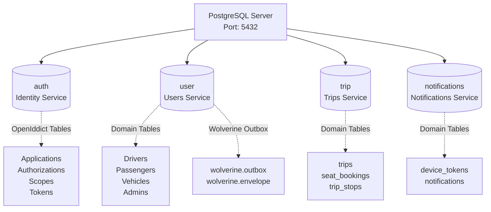

Masar Eagle follows the **database-per-service** pattern where each microservice owns its dedicated PostgreSQL database. Database schemas are managed through **FluentMigrator** for version-controlled, code-first migrations.

## Database Architecture



## Database Provisioning

Databases are provisioned through .NET Aspire:

```csharp src/aspire/AppHost/AppHost.cs:9
IResourceBuilder<PostgresServerResource> postgres = builder.AddPostgres(Components.Postgres)
    .WithEnvironment("POSTGRES_HOST_AUTH_METHOD", "trust")
    .WithDataVolume(name: "masar-postgres-data", isReadOnly: false)
    .WithPgAdmin(pgAdmin => pgAdmin.WithHostPort(5050));

IResourceBuilder<PostgresDatabaseResource> usersDb = postgres.AddDatabase(Components.Database.User);
IResourceBuilder<PostgresDatabaseResource> tripsDb = postgres.AddDatabase(Components.Database.Trip);
IResourceBuilder<PostgresDatabaseResource> notificationsDb = postgres.AddDatabase(Components.Database.Notifications);
IResourceBuilder<PostgresDatabaseResource> authDb = postgres.AddDatabase(Components.Database.Auth);
```

<Info>
**PgAdmin**: A web-based PostgreSQL administration tool is available at `http://localhost:5050` for database inspection and query execution.
</Info>

## Migration System

### FluentMigrator Framework

Masar Eagle uses **FluentMigrator** for database migrations:

- **Code-first**: Schema defined in C# code
- **Version-controlled**: Migrations tracked via Git
- **Reversible**: Support for `Up()` and `Down()` methods
- **Cross-platform**: Works on any OS with .NET runtime

### Base Migration Class

All migrations inherit from a custom base class:

```csharp src/BuildingBlocks/MasarEagle.Migrations/BaseMigration.cs:7
public abstract class BaseMigration : Migration
{
    protected abstract string ServiceName { get; }

    protected void CreateTableWithStandardColumns(
        string tableName, 
        Action<ICreateTableColumnOptionOrWithColumnSyntax>? additionalColumns = null)
    {
        if (!Schema.Table(tableName).Exists())
        {
            ICreateTableColumnOptionOrWithColumnSyntax? table = Create.Table(tableName)
                .WithColumn("Id").AsString(50).PrimaryKey().NotNullable()
                .WithColumn("CreatedAt").AsDateTime().NotNullable()
                    .WithDefault(SystemMethods.CurrentDateTime)
                .WithColumn("UpdatedAt").AsDateTime().NotNullable()
                    .WithDefault(SystemMethods.CurrentDateTime)
                .WithColumn("IsDeleted").AsBoolean().NotNullable().WithDefaultValue(false)
                .WithColumn("DeletedAt").AsDateTime().Nullable();

            additionalColumns?.Invoke(table);
        }
    }

    protected void CreateIndexIfNotExists(
        string tableName, 
        string[] columnNames, 
        bool isUnique = false)
    {
        string indexName = $"IX_{tableName}_{string.Join("_", columnNames)}";
        string uniqueKeyword = isUnique ? "UNIQUE" : "";
        string columnList = string.Join(", ", columnNames.Select(c => $"\"{c}\" ASC"));
        
        Execute.Sql($@"
            CREATE {uniqueKeyword} INDEX IF NOT EXISTS ""{indexName}""
            ON ""{tableName}"" ({columnList});
        ");
    }

    protected void CreateForeignKeyIfNotExists(
        string tableName,
        string columnName,
        string referencedTable,
        string referencedColumn = "Id",
        System.Data.Rule onDelete = System.Data.Rule.Cascade)
    {
        string fkName = $"FK_{tableName}_{referencedTable}";
        string onDeleteAction = onDelete switch
        {
            System.Data.Rule.Cascade => "CASCADE",
            System.Data.Rule.SetNull => "SET NULL",
            System.Data.Rule.SetDefault => "SET DEFAULT",
            _ => "NO ACTION"
        };

        Execute.Sql($@"
            DO $$
            BEGIN
                IF NOT EXISTS (
                    SELECT 1 FROM information_schema.table_constraints 
                    WHERE constraint_name = '{fkName}' 
                    AND table_name = '{tableName}'
                ) THEN
                    ALTER TABLE ""{tableName}""
                    ADD CONSTRAINT ""{fkName}""
                    FOREIGN KEY (""{columnName}"")
                    REFERENCES ""{referencedTable}"" (""{referencedColumn}"")
                    ON DELETE {onDeleteAction};
                END IF;
            END $$;
        ");
    }
}
```

<Note>
**Standard Columns**: All domain tables include:
- `Id`: Primary key (string, 50 chars)
- `CreatedAt`: Timestamp of creation
- `UpdatedAt`: Timestamp of last update
- `IsDeleted`: Soft delete flag
- `DeletedAt`: Soft delete timestamp
</Note>

### Migration Execution

Migrations run automatically on service startup:

```csharp src/BuildingBlocks/MasarEagle.Migrations/DatabaseMigrationService.cs:18
public class DatabaseMigrationService(
    IServiceProvider serviceProvider,
    ILogger<DatabaseMigrationService> logger,
    string connectionString,
    int maxRetries = 30,
    int retryDelaySeconds = 5)
    : BackgroundService
{
    protected override async Task ExecuteAsync(CancellationToken stoppingToken)
    {
        logger.LogInformation("🚀 Starting database migration service...");

        try
        {
            await WaitForDatabaseAsync(stoppingToken);
            await RunMigrationsAsync();
            logger.LogInformation("✅ Database migrations completed successfully");
        }
        catch (Exception ex)
        {
            logger.LogCritical(ex, "❌ Database migration failed. Application cannot start.");
            throw;
        }
    }

    private async Task WaitForDatabaseAsync(CancellationToken cancellationToken)
    {
        for (int attempt = 1; attempt <= maxRetries; attempt++)
        {
            try
            {
                // Ensure database exists
                await EnsureDatabaseExistsAsync(cancellationToken);
                
                // Test connection
                await using var dataSource = NpgsqlDataSource.Create(connectionString);
                await using NpgsqlConnection connection = await dataSource.OpenConnectionAsync(cancellationToken);
                await using var command = new NpgsqlCommand("SELECT 1", connection);
                await command.ExecuteScalarAsync(cancellationToken);

                logger.LogInformation("✅ Database is ready (attempt {Attempt}/{MaxRetries})", 
                    attempt, maxRetries);
                return;
            }
            catch (Exception ex) when (attempt < maxRetries)
            {
                logger.LogWarning("⚠️ Database not ready (attempt {Attempt}/{MaxRetries}). Retrying in {Delay}s...", 
                    attempt, maxRetries, retryDelaySeconds);
                await Task.Delay(TimeSpan.FromSeconds(retryDelaySeconds), cancellationToken);
            }
        }
    }

    private Task RunMigrationsAsync()
    {
        using IServiceScope scope = serviceProvider.CreateScope();
        IMigrationRunner runner = scope.ServiceProvider.GetRequiredService<IMigrationRunner>();

        if (runner.HasMigrationsToApplyUp())
        {
            SortedList<long, IMigrationInfo>? pendingMigrations = runner.MigrationLoader.LoadMigrations();
            logger.LogInformation("📋 Found {Count} pending migrations", pendingMigrations.Count);
        }

        runner.MigrateUp();
        logger.LogInformation("✅ All migrations applied successfully");
        return Task.CompletedTask;
    }
}
```

<Accordion title="Automatic Database Creation">
If the database doesn't exist, the migration service creates it:

```csharp src/BuildingBlocks/MasarEagle.Migrations/DatabaseMigrationService.cs:77
private async Task EnsureDatabaseExistsAsync(CancellationToken cancellationToken)
{
    var builder = new NpgsqlConnectionStringBuilder(connectionString);
    string? databaseName = builder.Database;
    
    string adminConnectionString = new NpgsqlConnectionStringBuilder(connectionString)
    {
        Database = "postgres"  // Connect to default postgres database
    }.ToString();

    await using var dataSource = NpgsqlDataSource.Create(adminConnectionString);
    await using NpgsqlConnection connection = await dataSource.OpenConnectionAsync(cancellationToken);
    
    await using var checkCmd = new NpgsqlCommand(
        "SELECT 1 FROM pg_database WHERE datname = @databaseName", connection);
    checkCmd.Parameters.AddWithValue("databaseName", databaseName);
    
    object? exists = await checkCmd.ExecuteScalarAsync(cancellationToken);
    
    if (exists == null)
    {
        logger.LogInformation("🔧 Database '{DatabaseName}' does not exist. Creating...", databaseName);
        
        string createDatabaseQuery = $"CREATE DATABASE \"{databaseName}\"";
        await using var createCmd = new NpgsqlCommand(createDatabaseQuery, connection);
        await createCmd.ExecuteNonQueryAsync(cancellationToken);
    }
}
```
</Accordion>

### Service Registration

Each service registers migrations on startup:

```csharp src/services/Users/Users.Api/Program.cs:62
builder.Services.AddDatabaseMigrations(
    builder.Configuration,
    Assembly.GetExecutingAssembly(),
    connectionStringName: Components.Database.User);
```

## Schema Designs

### 1. Users Database (`user`)

The Users service manages driver, passenger, admin, and vehicle data.

#### Core Tables

<Tabs>
  <Tab title="Drivers">
    ```csharp src/services/Users/Users.Api/Infrastructure/Migrations/202501070001_InitialSchema.cs:13
    CreateTableWithStandardColumns("Drivers", table => table
        .WithColumn("PhoneNumber").AsString(450).NotNullable().Unique()
        .WithColumn("FullName").AsString(256).Nullable()
        .WithColumn("DateOfBirth").AsDate().Nullable()
        .WithColumn("ProfilePictureUrl").AsString().Nullable()
        .WithColumn("IdentityDocumentUrl").AsString().Nullable()
        .WithColumn("DrivingLicenseUrl").AsString().Nullable()
        .WithColumn("IsPhoneVerified").AsBoolean().NotNullable().WithDefaultValue(false)
        .WithColumn("IsProfileComplete").AsBoolean().NotNullable().WithDefaultValue(false)
        .WithColumn("IsActive").AsBoolean().NotNullable().WithDefaultValue(true)
        .WithColumn("LastLoginAt").AsDateTime().Nullable()
    );
    ```
    
    **Indexes**:
    - `IX_Drivers_PhoneNumber` (UNIQUE)
    - `IX_Drivers_IsDeleted_IsActive`
  </Tab>
  
  <Tab title="Passengers">
    ```csharp src/services/Users/Users.Api/Infrastructure/Migrations/202501070001_InitialSchema.cs:26
    CreateTableWithStandardColumns("Passengers", table => table
        .WithColumn("PhoneNumber").AsString(450).NotNullable().Unique()
        .WithColumn("FullName").AsString(256).Nullable()
        .WithColumn("DateOfBirth").AsDate().Nullable()
        .WithColumn("Gender").AsInt32().NotNullable().WithDefaultValue(0)
        .WithColumn("ProfilePictureUrl").AsString().Nullable()
        .WithColumn("IsPhoneVerified").AsBoolean().NotNullable().WithDefaultValue(false)
        .WithColumn("IsProfileComplete").AsBoolean().NotNullable().WithDefaultValue(false)
        .WithColumn("IsActive").AsBoolean().NotNullable().WithDefaultValue(true)
        .WithColumn("LastLoginAt").AsDateTime().Nullable()
    );
    ```
    
    **Indexes**:
    - `IX_Passengers_PhoneNumber` (UNIQUE)
    - `IX_Passengers_IsDeleted_IsActive`
  </Tab>
  
  <Tab title="Vehicles">
    ```csharp src/services/Users/Users.Api/Infrastructure/Migrations/202501070001_InitialSchema.cs:53
    CreateTableWithStandardColumns("Vehicles", table => table
        .WithColumn("Name").AsString(256).NotNullable()
        .WithColumn("Model").AsString(256).NotNullable()
        .WithColumn("VehicleTypeId").AsString(450).NotNullable()
        .WithColumn("DriverId").AsString(450).NotNullable()
        .WithColumn("IsActive").AsBoolean().NotNullable().WithDefaultValue(true)
    );
    
    CreateForeignKeyIfNotExists("Vehicles", "DriverId", "Drivers", 
        onDelete: System.Data.Rule.Cascade);
    CreateForeignKeyIfNotExists("Vehicles", "VehicleTypeId", "VehicleTypes", 
        onDelete: System.Data.Rule.None);
    ```
    
    **Foreign Keys**:
    - `FK_Vehicles_Drivers`: ON DELETE CASCADE
    - `FK_Vehicles_VehicleTypes`: ON DELETE NO ACTION
  </Tab>
  
  <Tab title="Admins">
    ```csharp src/services/Users/Users.Api/Infrastructure/Migrations/202501070001_InitialSchema.cs:38
    CreateTableWithStandardColumns("Admins", table => table
        .WithColumn("Email").AsString(256).NotNullable().Unique()
        .WithColumn("PasswordHash").AsString().NotNullable()
        .WithColumn("FullName").AsString(256).Nullable()
        .WithColumn("IsActive").AsBoolean().NotNullable().WithDefaultValue(true)
        .WithColumn("LastLoginAt").AsDateTime().Nullable()
    );
    ```
    
    **Indexes**:
    - `IX_Admins_Email` (UNIQUE)
  </Tab>
</Tabs>

#### Wolverine Outbox Schema

The Users service uses transactional outbox for guaranteed message delivery:

```sql
-- Wolverine creates these tables automatically
CREATE SCHEMA wolverine;

CREATE TABLE wolverine.outbox (
    id BIGSERIAL PRIMARY KEY,
    message_type VARCHAR(500) NOT NULL,
    body BYTEA NOT NULL,
    destination VARCHAR(500),
    deliver_by TIMESTAMP,
    attempts INTEGER DEFAULT 0,
    created_at TIMESTAMP DEFAULT NOW(),
    status VARCHAR(50) DEFAULT 'Pending'
);

CREATE TABLE wolverine.envelope (
    id UUID PRIMARY KEY,
    message_type VARCHAR(500) NOT NULL,
    body BYTEA NOT NULL,
    owner_id INTEGER DEFAULT 0,
    status VARCHAR(50) DEFAULT 'Incoming',
    execution_time TIMESTAMP,
    attempts INTEGER DEFAULT 0
);
```

<Note>
**Automatic Schema Management**: Wolverine creates and manages these tables automatically when `EnablePostgresOutbox = true`.
</Note>

### 2. Trips Database (`trip`)

The Trips service manages trip scheduling, bookings, and seat assignments.

#### Core Tables

<Tabs>
  <Tab title="trips">
    ```csharp src/services/Trips/Trips.Api/Infrastructure/Migrations/202501070002_CreateTripsTableOnly.cs:14
    Create.Table("trips")
        .WithColumn("id").AsString(450).PrimaryKey()
        .WithColumn("from_city").AsString(450).NotNullable()
        .WithColumn("to_city").AsString(450).NotNullable()
        .WithColumn("departure_time_utc").AsDateTimeOffset().NotNullable()
        .WithColumn("arrival_time_utc").AsDateTimeOffset().Nullable()
        .WithColumn("description").AsString(1000).Nullable()
        .WithColumn("price").AsDecimal(10, 2).NotNullable()
        .WithColumn("status").AsString(50).NotNullable()
            .WithDefaultValue(TripStatuses.Scheduled)
        .WithColumn("available_seats").AsInt32().NotNullable()
        .WithColumn("total_seats").AsInt32().NotNullable()
        .WithColumn("vehicle_id").AsString(450).NotNullable()
        .WithColumn("driver_id").AsString(450).NotNullable()
        .WithColumn("created_at_utc").AsDateTimeOffset().NotNullable()
            .WithDefaultValue(SystemMethods.CurrentUTCDateTime)
        .WithColumn("updated_at_utc").AsDateTimeOffset().NotNullable()
            .WithDefaultValue(SystemMethods.CurrentUTCDateTime);
    
    Create.Index("IX_trips_vehicle_id").OnTable("trips").OnColumn("vehicle_id");
    Create.Index("IX_trips_driver_id").OnTable("trips").OnColumn("driver_id");
    ```
    
    **Trip Statuses**:
    - `Scheduled`: Trip created, awaiting departure
    - `Started`: Trip in progress
    - `Completed`: Trip finished
    - `Cancelled`: Trip cancelled
  </Tab>
  
  <Tab title="seat_bookings">
    ```csharp src/services/Trips/Trips.Api/Infrastructure/Migrations/202501070002_CreateTripsTableOnly.cs:38
    Create.Table("seat_bookings")
        .WithColumn("id").AsString(450).PrimaryKey()
        .WithColumn("trip_id").AsString(450).NotNullable()
        .WithColumn("seat_number").AsInt32().NotNullable()
        .WithColumn("passenger_id").AsString(450).NotNullable()
        .WithColumn("passenger_name").AsString(256).NotNullable()
        .WithColumn("passenger_phone").AsString(50).NotNullable()
        .WithColumn("status").AsString(50).NotNullable()
            .WithDefaultValue(BookingStatuses.Pending)
        .WithColumn("booked_at_utc").AsDateTimeOffset().NotNullable()
            .WithDefaultValue(SystemMethods.CurrentUTCDateTime)
        .WithColumn("confirmed_at_utc").AsDateTimeOffset().Nullable();
    
    Create.Index("IX_seat_bookings_trip_id").OnTable("seat_bookings")
        .OnColumn("trip_id");
    ```
    
    **Booking Statuses**:
    - `Pending`: Awaiting driver/admin approval
    - `Confirmed`: Booking approved
    - `Cancelled`: Booking cancelled
    - `Completed`: Trip completed
  </Tab>
  
  <Tab title="trip_stops">
    ```csharp src/services/Trips/Trips.Api/Infrastructure/Migrations/202501070002_CreateTripsTableOnly.cs:30
    Create.Table("trip_stops")
        .WithColumn("id").AsString(450).PrimaryKey()
        .WithColumn("trip_id").AsString(450).NotNullable()
        .WithColumn("location").AsString(450).NotNullable()
        .WithColumn("stop_time_utc").AsDateTimeOffset().Nullable()
        .WithColumn("stop_order").AsInt32().NotNullable()
        .WithColumn("description").AsString(1000).Nullable();
    
    Create.Index("IX_trip_stops_trip_id").OnTable("trip_stops")
        .OnColumn("trip_id");
    ```
    
    Trip stops define intermediate waypoints along the route.
  </Tab>
</Tabs>

<Warning>
**Foreign Key Strategy**: The Trips database does **not** have foreign keys to Users database (cross-database constraints are not supported). Instead, referential integrity is enforced at the application layer.
</Warning>

### 3. Notifications Database (`notifications`)

The Notifications service stores device tokens and notification history.

#### Core Tables

<Tabs>
  <Tab title="device_tokens">
    ```csharp src/services/Notifications/Notifications.Api/Infrastructure/Migrations/202501070024_CreateDeviceTokensTable.cs:15
    Create.Table("device_tokens")
        .WithColumn("id").AsString(450).PrimaryKey()
        .WithColumn("user_id").AsString(450).NotNullable()
        .WithColumn("user_type").AsString(50).NotNullable()
        .WithColumn("device_token").AsString(500).NotNullable()
        .WithColumn("platform").AsString(50).Nullable()  // "ios", "android"
        .WithColumn("app_version").AsString(20).Nullable()
        .WithColumn("is_active").AsBoolean().NotNullable().WithDefaultValue(true)
        .WithColumn("created_at_utc").AsDateTime().NotNullable()
            .WithDefaultValue(SystemMethods.CurrentUTCDateTime)
        .WithColumn("updated_at_utc").AsDateTime().NotNullable()
            .WithDefaultValue(SystemMethods.CurrentUTCDateTime);

    Create.Index("IX_device_tokens_user_id").OnTable("device_tokens")
        .OnColumn("user_id");
    Create.Index("IX_device_tokens_user_type").OnTable("device_tokens")
        .OnColumn("user_type");
    Create.Index("IX_device_tokens_is_active").OnTable("device_tokens")
        .OnColumn("is_active");
    
    Create.UniqueConstraint("UQ_device_tokens_user_token").OnTable("device_tokens")
        .Columns("user_id", "device_token");
    ```
    
    **Composite Unique Constraint**: Prevents duplicate device tokens for the same user.
  </Tab>
  
  <Tab title="notifications">
    ```sql
    CREATE TABLE notifications (
        id VARCHAR(450) PRIMARY KEY,
        notification_type VARCHAR(100) NOT NULL,
        recipient_id VARCHAR(450) NOT NULL,
        recipient_type VARCHAR(50) NOT NULL,
        title TEXT NOT NULL,
        body TEXT NOT NULL,
        data JSONB,
        is_read BOOLEAN DEFAULT FALSE,
        sent_at_utc TIMESTAMP NOT NULL,
        created_at_utc TIMESTAMP NOT NULL
    );
    
    CREATE INDEX IX_notifications_recipient_id ON notifications (recipient_id);
    CREATE INDEX IX_notifications_is_read ON notifications (is_read);
    CREATE INDEX IX_notifications_sent_at_utc ON notifications (sent_at_utc);
    ```
    
    Stores notification history for querying by users.
  </Tab>
</Tabs>

### 4. Auth Database (`auth`)

The Identity service uses **OpenIddict** tables for OAuth 2.0 / OpenID Connect:

<Accordion title="OpenIddict Schema">
OpenIddict automatically creates these tables:

```sql
-- Applications (OAuth clients)
CREATE TABLE OpenIddictApplications (
    Id VARCHAR(450) PRIMARY KEY,
    ClientId VARCHAR(100) UNIQUE NOT NULL,
    ClientSecret VARCHAR(500),
    DisplayName VARCHAR(200),
    Permissions TEXT,
    Requirements TEXT,
    Type VARCHAR(50)
);

-- Authorizations (consent records)
CREATE TABLE OpenIddictAuthorizations (
    Id VARCHAR(450) PRIMARY KEY,
    ApplicationId VARCHAR(450),
    Subject VARCHAR(450),
    Status VARCHAR(50),
    Type VARCHAR(50),
    Scopes TEXT,
    CreationDate TIMESTAMP
);

-- Tokens (access, refresh, authorization codes)
CREATE TABLE OpenIddictTokens (
    Id VARCHAR(450) PRIMARY KEY,
    ApplicationId VARCHAR(450),
    AuthorizationId VARCHAR(450),
    Subject VARCHAR(450),
    Type VARCHAR(50),
    Status VARCHAR(50),
    Payload TEXT,
    CreationDate TIMESTAMP,
    ExpirationDate TIMESTAMP
);

-- Scopes (OAuth scopes)
CREATE TABLE OpenIddictScopes (
    Id VARCHAR(450) PRIMARY KEY,
    Name VARCHAR(200) UNIQUE NOT NULL,
    DisplayName VARCHAR(200),
    Description TEXT,
    Resources TEXT
);
```
</Accordion>

<Note>
**Token Pruning**: A background worker periodically deletes expired tokens to prevent table bloat.
</Note>

## Data Types and Conventions

### Primary Keys

All entities use **string-based GUIDs** with a prefix:

```csharp
// Driver ID
Id = $"d_{Guid.NewGuid():N}"  // e.g., "d_0191234567890abcd"

// Passenger ID
Id = $"p_{Guid.NewGuid():N}"  // e.g., "p_abc1234567890def"

// Trip ID
Id = $"t_{Guid.NewGuid():N}"  // e.g., "t_xyz9876543210fed"
```

<Info>
**Why Prefixed IDs?** 
- Easy to identify entity type from ID alone
- Prevents accidental type confusion
- Human-readable in logs and debugging
</Info>

### Timestamps

<Tabs>
  <Tab title="DateTime (UTC)">
    Most tables use `DateTime` stored in UTC:
    
    ```csharp
    .WithColumn("CreatedAt").AsDateTime().NotNullable()
        .WithDefault(SystemMethods.CurrentDateTime)
    ```
  </Tab>
  
  <Tab title="DateTimeOffset">
    Trips service uses `DateTimeOffset` to preserve timezone info:
    
    ```csharp
    .WithColumn("departure_time_utc").AsDateTimeOffset().NotNullable()
    ```
  </Tab>
</Tabs>

### Soft Deletes

All domain entities support soft deletion:

```csharp
.WithColumn("IsDeleted").AsBoolean().NotNullable().WithDefaultValue(false)
.WithColumn("DeletedAt").AsDateTime().Nullable()
```

Application code filters soft-deleted records:

```csharp
var activeDrivers = await db.Drivers
    .Where(d => !d.IsDeleted)
    .ToListAsync();
```

### Money/Decimal

Prices and monetary values use `DECIMAL(10, 2)`:

```csharp
.WithColumn("price").AsDecimal(10, 2).NotNullable()
```

This supports values up to **99,999,999.99** with exact precision (no floating-point errors).

## Indexing Strategy

### Composite Indexes

Queries that filter on multiple columns benefit from composite indexes:

```csharp
CreateIndexIfNotExists("Drivers", new[] { "IsDeleted", "IsActive" });
```

This index accelerates queries like:

```sql
SELECT * FROM "Drivers" WHERE "IsDeleted" = false AND "IsActive" = true;
```

### Unique Constraints

Enforce uniqueness at database level:

```csharp
.WithColumn("PhoneNumber").AsString(450).NotNullable().Unique()
```

<Warning>
**Index Column Length**: PostgreSQL limits indexed string columns to **~2,700 bytes**. We use 450 characters to stay well below this limit.
</Warning>

## Query Performance

### Connection Pooling

All services use **Npgsql connection pooling**:

```csharp
// Connection string from Aspire
"Host=postgres;Port=5432;Database=user;Pooling=true;Minimum Pool Size=0;Maximum Pool Size=100"
```

### Prepared Statements

LinqToDB (used for data access) automatically uses prepared statements for repeated queries.

### Query Logging

Enable query logging in development:

```json appsettings.Development.json
{
  "Logging": {
    "LogLevel": {
      "LinqToDB": "Information"
    }
  }
}
```

## Backup and Recovery

### Automated Backups

Use `pg_dump` for regular backups:

```bash
# Backup all databases
docker exec -t masar-postgres pg_dumpall -c -U postgres > backup_$(date +%Y%m%d).sql

# Restore
docker exec -i masar-postgres psql -U postgres < backup_20260101.sql
```

### Point-in-Time Recovery

Enable WAL archiving for production:

```ini postgresql.conf
wal_level = replica
archive_mode = on
archive_command = 'cp %p /archive/%f'
```

## Monitoring

### PgAdmin

Access PgAdmin at `http://localhost:5050`:

1. Add server connection
2. View table schemas
3. Execute ad-hoc queries
4. Monitor active queries
5. Analyze query plans

### Database Size

Monitor database growth:

```sql
SELECT 
    datname AS database,
    pg_size_pretty(pg_database_size(datname)) AS size
FROM pg_database
WHERE datname IN ('auth', 'user', 'trip', 'notifications');
```

### Slow Query Log

Enable slow query logging:

```ini postgresql.conf
log_min_duration_statement = 1000  # Log queries slower than 1 second
```

## Best Practices

<CardGroup cols={2}>
  <Card title="Always Use Migrations" icon="database">
    Never modify schema directly in production—always create a migration.
  </Card>
  
  <Card title="Test Migrations Locally" icon="vial">
    Run migrations on a copy of production data to catch issues.
  </Card>
  
  <Card title="Index Foreign Keys" icon="link">
    Always index columns used in JOINs or WHERE clauses.
  </Card>
  
  <Card title="Use Composite Indexes" icon="layer-group">
    For multi-column filters, create composite indexes in the right order.
  </Card>
  
  <Card title="Monitor Query Performance" icon="gauge">
    Use `EXPLAIN ANALYZE` to optimize slow queries.
  </Card>
  
  <Card title="Backup Before Migrations" icon="copy">
    Always backup production databases before applying migrations.
  </Card>
</CardGroup>

## Troubleshooting

<AccordionGroup>
  <Accordion title="Migration Fails to Apply">
    **Symptoms**: Service crashes on startup with migration error
    
    **Solutions**:
    - Check migration syntax: Test migration in isolated PostgreSQL instance
    - Review migration logs: Look for SQL syntax errors
    - Check for conflicting migrations: Ensure migration numbers are unique
    - Verify database permissions: Ensure service user has DDL rights
    - Manually revert: Connect to database and drop problematic objects
  </Accordion>
  
  <Accordion title="Connection Pool Exhaustion">
    **Symptoms**: "Timeout waiting for connection from pool"
    
    **Solutions**:
    - Check for connection leaks: Ensure all connections are disposed
    - Increase pool size: Adjust `Maximum Pool Size` in connection string
    - Monitor active connections: Query `pg_stat_activity`
    - Reduce query duration: Optimize slow queries
  </Accordion>
  
  <Accordion title="Slow Queries">
    **Symptoms**: API endpoints timeout or respond slowly
    
    **Solutions**:
    - Identify slow queries: Enable `log_min_duration_statement`
    - Analyze query plan: Use `EXPLAIN ANALYZE`
    - Add missing indexes: Create indexes on filtered columns
    - Optimize JOINs: Ensure foreign keys are indexed
    - Use pagination: Limit result sets with OFFSET/LIMIT
  </Accordion>
  
  <Accordion title="Database Locks">
    **Symptoms**: Queries hang or timeout
    
    **Solutions**:
    - Identify blocking queries: Query `pg_locks` and `pg_stat_activity`
    - Kill blocking connections: `SELECT pg_terminate_backend(pid)`
    - Reduce transaction scope: Commit transactions more frequently
    - Use optimistic concurrency: Handle version conflicts in application code
  </Accordion>
</AccordionGroup>

## Related Topics

<CardGroup cols={2}>
  <Card title="Microservices Architecture" href="/concepts/microservices-architecture" icon="diagram-project">
    Database-per-service pattern and service boundaries
  </Card>
  <Card title="Services Overview" href="/concepts/services-overview" icon="sitemap">
    Which service owns which database
  </Card>
  <Card title="Messaging" href="/concepts/messaging" icon="message">
    Wolverine outbox schema and transactional messaging
  </Card>
</CardGroup>
