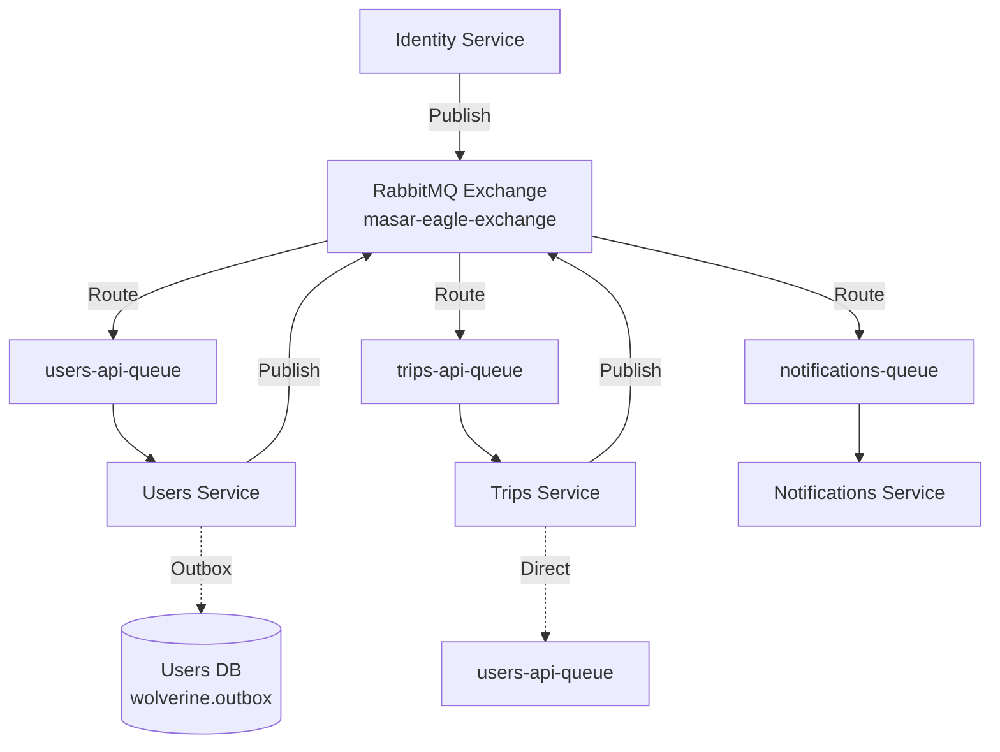

Masar Eagle uses **asynchronous messaging** as the primary communication mechanism between microservices. The system leverages **RabbitMQ** for message transport and **Wolverine** as the .NET messaging framework, implementing patterns like publish-subscribe, transactional outbox, and guaranteed delivery.

## Messaging Architecture



## RabbitMQ Configuration

RabbitMQ is orchestrated through .NET Aspire with persistent storage:

```csharp src/aspire/AppHost/AppHost.cs:21
IResourceBuilder<RabbitMQServerResource> rabbitmq = builder.AddRabbitMQ(
    Components.RabbitMQ, 
    username, 
    password)
    .WithDataVolume(Components.RabbitMQConfig.DataVolumeName)
    .WithManagementPlugin(port: int.Parse(Components.RabbitMQConfig.ManagementPort));
```

### Management UI

RabbitMQ provides a web interface at `http://localhost:15672` (default credentials are provided via parameters):

- **Exchanges**: View message routing topology
- **Queues**: Monitor queue depth and consumer status
- **Connections**: Track active service connections
- **Channels**: Debug message flow

<Info>
The management plugin is enabled automatically in development. In production, secure it behind authentication and firewall rules.
</Info>

## Wolverine Messaging Framework

**Wolverine** is a next-generation .NET messaging library that provides:

- **Automatic handler discovery**: No manual registration needed
- **Transactional outbox pattern**: Guaranteed message delivery
- **Retry policies**: Configurable error handling
- **Message routing**: Flexible publish-subscribe patterns
- **OpenTelemetry integration**: Distributed tracing

### Basic Configuration

Services configure Wolverine using a common extension method:

```csharp src/BuildingBlocks/Common/WolverineExtensions.cs:29
public static async Task UseWolverineWithRabbitMqAsync(
    this IHostApplicationBuilder builder, 
    Action<WolverineOptions> configureMessaging)
{
    // Wait for RabbitMQ with retry policy
    AsyncRetryPolicy retryPolicy = Policy
        .Handle<BrokerUnreachableException>()
        .Or<SocketException>()
        .WaitAndRetryAsync(
            retryCount: 5,
            retryAttempt => TimeSpan.FromSeconds(Math.Pow(2, retryAttempt)));

    await retryPolicy.ExecuteAsync(async () =>
    {
        string endpoint = builder.Configuration
            .GetConnectionString(Components.RabbitMQConfig.ConnectionName)
            ?? throw new InvalidOperationException("messaging connection string not found");

        var factory = new ConnectionFactory { Uri = new Uri(endpoint) };
        await using IConnection connection = await factory.CreateConnectionAsync();
    });

    // Add OpenTelemetry tracing
    builder.Services.AddOpenTelemetry().WithTracing(traceProviderBuilder => 
        traceProviderBuilder
            .SetResourceBuilder(ResourceBuilder.CreateDefault()
                .AddService(builder.Environment.ApplicationName))
            .AddSource("Wolverine"));

    builder.UseWolverine(opts =>
    {
        opts.UseRabbitMqUsingNamedConnection(Components.RabbitMQConfig.ConnectionName)
            .AutoProvision()  // Automatically create exchanges and queues
            .DeclareExchange(Components.RabbitMQConfig.ExchangeName);

        configureMessaging(opts);
    });
}
```

<Note>
**Exponential Backoff**: The retry policy waits 2^n seconds between attempts, allowing RabbitMQ time to start during deployment.
</Note>

## Messaging Patterns

### 1. Publish-Subscribe (Fan-Out)

Multiple services can subscribe to the same event type:

```csharp src/services/Users/Users.Api/Program.cs:116
await builder.UseWolverineWithRabbitMqAsync(
    new WolverineMessagingOptions
    {
        EnablePostgresOutbox = true,
        PostgresConnectionName = Components.Database.User,
        OutboxSchema = "wolverine"
    },
    opts =>
    {
        // Publish all messages to main exchange
        opts.PublishAllMessages().ToRabbitExchange(Components.RabbitMQConfig.ExchangeName);
        
        // Listen to users-specific queue
        opts.ListenToRabbitQueue("users-api-queue",
            cfg => cfg.BindExchange(Components.RabbitMQConfig.ExchangeName));
        
        opts.ApplicationAssembly = typeof(Program).Assembly;
    });
```

**How it works**:
1. Service publishes message to `masar-eagle-exchange`
2. RabbitMQ routes message to all bound queues
3. Each service consumes from its own queue independently

### 2. Point-to-Point (Direct Routing)

Send messages to a specific service queue:

```csharp src/services/Trips/Trips.Api/Program.cs:136
await builder.UseWolverineWithRabbitMqAsync(opts =>
{
    // Route specific commands to Users service
    opts.PublishMessage<UpdateDriverRatingCommand>()
        .ToRabbitQueue("users-api-queue");
    opts.PublishMessage<UpdatePassengerRatingCommand>()
        .ToRabbitQueue("users-api-queue");
    
    // Broadcast notifications to exchange
    opts.Publish()
        .MessagesFromAssemblyContaining<DriverCreatedNotification>()
        .ToRabbitExchange(Components.RabbitMQConfig.ExchangeName);
    
    opts.ListenToRabbitQueue("trips-api-queue",
        cfg => cfg.BindExchange(Components.RabbitMQConfig.ExchangeName));
});
```

<Tabs>
  <Tab title="Broadcast to Exchange">
    ```csharp
    // Publish to exchange (fan-out to all subscribers)
    opts.PublishAllMessages().ToRabbitExchange("masar-eagle-exchange");
    ```
    
    Use for:
    - Events that multiple services need to know about
    - Notifications
    - Domain events
  </Tab>
  
  <Tab title="Send to Specific Queue">
    ```csharp
    // Send directly to a service's queue
    opts.PublishMessage<UpdateDriverRatingCommand>()
        .ToRabbitQueue("users-api-queue");
    ```
    
    Use for:
    - Commands targeting a specific service
    - Request-response patterns
    - Cross-service operations
  </Tab>
</Tabs>

### 3. Transactional Outbox Pattern

The **outbox pattern** ensures messages are delivered exactly once, even if the message broker is temporarily unavailable:

```csharp src/services/Users/Users.Api/Program.cs:117
new WolverineMessagingOptions
{
    EnablePostgresOutbox = true,
    PostgresConnectionName = Components.Database.User,
    OutboxSchema = "wolverine"
}
```

#### How Outbox Works

<Steps>
  <Step title="Transactional Write">
    When publishing a message, Wolverine writes it to the `wolverine.outbox` table in the **same database transaction** as your business data:
    
    ```sql
    BEGIN;
      INSERT INTO "Drivers" (Id, FullName, ...) VALUES (...);
      INSERT INTO wolverine.outbox (message_type, body, ...) VALUES (...);
    COMMIT;
    ```
  </Step>
  
  <Step title="Background Polling">
    A background worker polls the outbox table:
    
    ```csharp src/BuildingBlocks/Common/WolverineExtensions.cs:99
    opts.PersistMessagesWithPostgresql(connectionString, messagingOptions.OutboxSchema);
    ```
  </Step>
  
  <Step title="Message Dispatch">
    Worker publishes messages to RabbitMQ and marks them as sent.
  </Step>
  
  <Step title="Cleanup">
    Wolverine periodically deletes old outbox records.
  </Step>
</Steps>

<Info>
**Why Outbox?** Without it, a failure between committing the database transaction and publishing to RabbitMQ would lose the message. The outbox ensures **at-least-once delivery**.
</Info>

## Message Handlers

### Automatic Handler Discovery

Wolverine automatically discovers handler classes and methods:

```csharp src/services/Notifications/Notifications.Api/Handlers/NotificationHandler.cs:14
public static partial class NotificationHandler
{
    // Wolverine discovers this method and invokes it when NotificationMessage arrives
    private static async Task HandleNotification(
        NotificationMessage notification,  // Message parameter
        FirebaseNotificationService firebaseService,  // Injected dependency
        IDeviceTokenRepository deviceTokenRepository,  // Injected dependency
        AppDataConnection db,  // Injected dependency
        ILogger logger)  // Injected dependency
    {
        logger.LogInformation("Processing notification: {NotificationId}", 
            notification.NotificationId);
        
        List<string> deviceTokens = await deviceTokenRepository
            .GetActiveTokensAsync(notification.RecipientId, cancellationToken);

        int successCount = await firebaseService.SendBatchAsync(
            deviceTokens,
            notification.Title,
            notification.Body,
            notification.Data,
            cancellationToken);

        await SaveNotificationToHistory(notification, db, cancellationToken);
    }
}
```

<Note>
**Convention-Based Discovery**: Wolverine discovers handlers by:
- Method name matching message type (e.g., `HandleNotification` for `NotificationMessage`)
- First parameter is the message type
- Additional parameters are injected from DI container
</Note>

### Handler Naming Conventions

Wolverine supports multiple naming patterns:

```csharp
// Pattern 1: Handle{MessageName}
public static Task HandleNotification(NotificationMessage message) { }

// Pattern 2: Consume{MessageName}
public static Task ConsumeNotification(NotificationMessage message) { }

// Pattern 3: Any method with message as first parameter
public static Task ProcessNotification(NotificationMessage message) { }
```

### Dependency Injection in Handlers

Wolverine automatically injects dependencies:

```csharp
public static async Task HandleUserAuthenticated(
    UserAuthenticatedEvent @event,      // Message
    AppDataConnection db,               // Scoped DI
    ILogger<UserHandler> logger,        // Scoped DI
    IConfiguration configuration)       // Singleton DI
{
    // Handler logic
}
```

## Publishing Messages

### From Application Code

Inject `IMessageBus` to publish messages:

```csharp src/services/Identity/src/Identity.Web/TokenEndpoint.cs:102
private static async Task VerifyOtpCode(
    PhoneNumber phone,
    string code,
    string userType,
    IOtpService otpService,
    IUserPhoneResolver phoneResolver,
    IMessageBus messageBus)  // Wolverine message bus
{
    var otpResult = await otpService.VerifyOtpAsync(phone.Value, code);

    // Publish event to ensure user is provisioned
    await messageBus.PublishAsync(
        new UserAuthenticatedEvent(phone.Value, userType, phone.Value));

    return await SignInAndPublish(userIdResult.Value, userType, phone.Value, messageBus);
}
```

### Message Contracts

Define message contracts in shared libraries:

```csharp
namespace MasarEagle.NotificationContracts.Notifications;

public record NotificationMessage(
    string NotificationId,
    NotificationType Type,
    string RecipientId,
    RecipientType RecipientType,
    string Title,
    string Body,
    Dictionary<string, string>? Data,
    DateTime CreatedAtUtc);

public enum NotificationType
{
    TripCreated,
    BookingCreated,
    BookingAccepted,
    TripStarted,
    TripCompleted,
    // ...
}
```

<Warning>
**Versioning**: Changes to message contracts require careful coordination:
- **Additive changes** (new optional properties) are safe
- **Breaking changes** (removing/renaming properties) require versioned handlers or gradual rollout
</Warning>

## Error Handling and Retries

### Automatic Retries

Wolverine automatically retries failed messages with exponential backoff:

```csharp
// Default retry policy (configured in Wolverine)
// Attempt 1: Immediate
// Attempt 2: After 1 second
// Attempt 3: After 5 seconds
// Attempt 4: After 30 seconds
// Attempt 5: Move to error queue
```

### Dead Letter Queue

Messages that fail after all retries are moved to an error queue:

```
masar-eagle-exchange-errors
```

Monitor this queue for:
- Deserialization errors (message schema mismatch)
- Unhandled exceptions in handlers
- Dependency failures (database down, external API timeout)

### Custom Error Handling

Implement error handling in your handler:

```csharp
public static async Task HandleNotification(
    NotificationMessage notification,
    FirebaseNotificationService firebaseService,
    ILogger logger)
{
    try
    {
        await firebaseService.SendAsync(notification);
    }
    catch (Exception ex)
    {
        logger.LogError(ex, "Error processing notification {NotificationId}", 
            notification.NotificationId);
        
        // Option 1: Rethrow to trigger Wolverine retry
        throw;
        
        // Option 2: Handle gracefully (message will be ACKed)
        // return;
    }
}
```

## Observability

### OpenTelemetry Tracing

Wolverine integrates with OpenTelemetry for distributed tracing:

```csharp src/BuildingBlocks/Common/WolverineExtensions.cs:61
builder.Services.AddOpenTelemetry().WithTracing(traceProviderBuilder => 
    traceProviderBuilder
        .SetResourceBuilder(ResourceBuilder.CreateDefault()
            .AddService(builder.Environment.ApplicationName))
        .AddSource("Wolverine"));
```

Each message creates a trace span:

```
Identity: POST /connect/token
  └─ Identity: Publish UserAuthenticatedEvent
       └─ RabbitMQ: Enqueue to masar-eagle-exchange
            └─ Users: Handle UserAuthenticatedEvent
                 └─ Users: Create driver record
```

### Logging

Wolverine logs message handling:

```
info: Wolverine[0]
      Executing handler for message NotificationMessage (ID: abc123)
info: Wolverine[0]
      Successfully handled message NotificationMessage (ID: abc123) in 234ms
```

### Metrics

Monitor via RabbitMQ management UI:
- **Message rate**: Messages/second published and consumed
- **Queue depth**: Number of pending messages
- **Consumer status**: Active/idle consumers
- **Memory usage**: RabbitMQ memory consumption

## Message Flow Examples

### Example 1: Trip Booking Notification

<Steps>
  <Step title="Passenger Books Trip">
    Trips service creates booking and publishes event:
    
    ```csharp
    await messageBus.PublishAsync(new BookingCreatedNotification(
        BookingId: bookingId,
        PassengerId: passengerId,
        TripId: tripId,
        SeatNumbers: seatNumbers));
    ```
  </Step>
  
  <Step title="RabbitMQ Routes Event">
    Event is routed to `notifications-queue`
  </Step>
  
  <Step title="Notifications Service Handles Event">
    ```csharp
    public static async Task HandleBookingCreated(
        BookingCreatedNotification notification,
        FirebaseNotificationService firebase)
    {
        await firebase.SendAsync(notification.PassengerId, 
            title: "تم حجز مقعدك",
            body: $"تم حجز المقعد {notification.SeatNumbers}");
    }
    ```
  </Step>
</Steps>

### Example 2: Rating Update (Direct Queue)

<Steps>
  <Step title="Passenger Rates Driver">
    Trips service publishes command directly to Users queue:
    
    ```csharp
    await messageBus.PublishAsync(new UpdateDriverRatingCommand(
        DriverId: driverId,
        Rating: 5,
        Comment: "Great driver!"));
    ```
  </Step>
  
  <Step title="Users Service Updates Rating">
    ```csharp
    public static async Task HandleUpdateDriverRating(
        UpdateDriverRatingCommand command,
        AppDataConnection db)
    {
        await db.Drivers
            .Where(d => d.Id == command.DriverId)
            .Set(d => d.Rating, command.Rating)
            .UpdateAsync();
    }
    ```
  </Step>
</Steps>

## Best Practices

<CardGroup cols={2}>
  <Card title="Idempotent Handlers" icon="check-double">
    Design handlers to be idempotent (safe to process multiple times):
    
    ```csharp
    // Check if already processed
    if (await db.ProcessedMessages.AnyAsync(m => m.Id == messageId))
        return;
    
    // Process message
    await DoWork();
    
    // Mark as processed
    await db.InsertAsync(new ProcessedMessage { Id = messageId });
    ```
  </Card>
  
  <Card title="Small Messages" icon="compress">
    Keep messages small—avoid embedding large payloads:
    
    ```csharp
    // Good: Reference by ID
    record TripCreatedEvent(string TripId);
    
    // Bad: Embed entire entity
    record TripCreatedEvent(Trip TripData);
    ```
  </Card>
  
  <Card title="Use Outbox for Critical Messages" icon="inbox">
    Enable outbox for services that require guaranteed delivery:
    
    ```csharp
    EnablePostgresOutbox = true
    ```
  </Card>
  
  <Card title="Monitor Dead Letters" icon="skull">
    Set up alerts for messages in error queues—they indicate systemic issues.
  </Card>
  
  <Card title="Version Message Contracts" icon="code-branch">
    Plan for contract evolution:
    
    ```csharp
    public record NotificationMessageV2(
        string NotificationId,
        string Title,
        string Body,
        string? ImageUrl = null);  // New optional field
    ```
  </Card>
  
  <Card title="Separate Read/Write Models" icon="split">
    Use events for writes, HTTP for reads (CQRS pattern).
  </Card>
</CardGroup>

## Troubleshooting

<AccordionGroup>
  <Accordion title="Messages Not Being Consumed">
    **Symptoms**: Messages pile up in queue, no handler execution
    
    **Solutions**:
    - Check handler discovery: Ensure handler method signature is correct
    - Verify queue binding: Check RabbitMQ management UI
    - Inspect logs: Look for Wolverine handler registration messages
    - Check service health: Ensure consumer service is running
  </Accordion>
  
  <Accordion title="Duplicate Message Processing">
    **Symptoms**: Same message processed multiple times
    
    **Solutions**:
    - Implement idempotency in handlers
    - Check RabbitMQ acknowledgment settings
    - Verify outbox isn't resending already-sent messages
    - Use message deduplication based on message ID
  </Accordion>
  
  <Accordion title="RabbitMQ Connection Failures">
    **Symptoms**: Services can't connect to RabbitMQ
    
    **Solutions**:
    - Verify RabbitMQ is running: `docker ps | grep rabbitmq`
    - Check connection string configuration
    - Ensure retry policy is configured (exponential backoff)
    - Check network connectivity and firewall rules
  </Accordion>
  
  <Accordion title="Outbox Table Growing Too Large">
    **Symptoms**: `wolverine.outbox` table consumes excessive disk space
    
    **Solutions**:
    - Configure outbox cleanup interval
    - Check for stale messages (RabbitMQ down for extended period)
    - Manually purge old outbox records
    - Increase outbox processing frequency
  </Accordion>
</AccordionGroup>

## Related Topics

<CardGroup cols={2}>
  <Card title="Microservices Architecture" href="/concepts/microservices-architecture" icon="diagram-project">
    How messaging fits into overall architecture
  </Card>
  <Card title="Services Overview" href="/concepts/services-overview" icon="sitemap">
    Which services publish and consume which events
  </Card>
  <Card title="Database Schema" href="/concepts/database-schema" icon="database">
    Wolverine outbox table schema
  </Card>
</CardGroup>