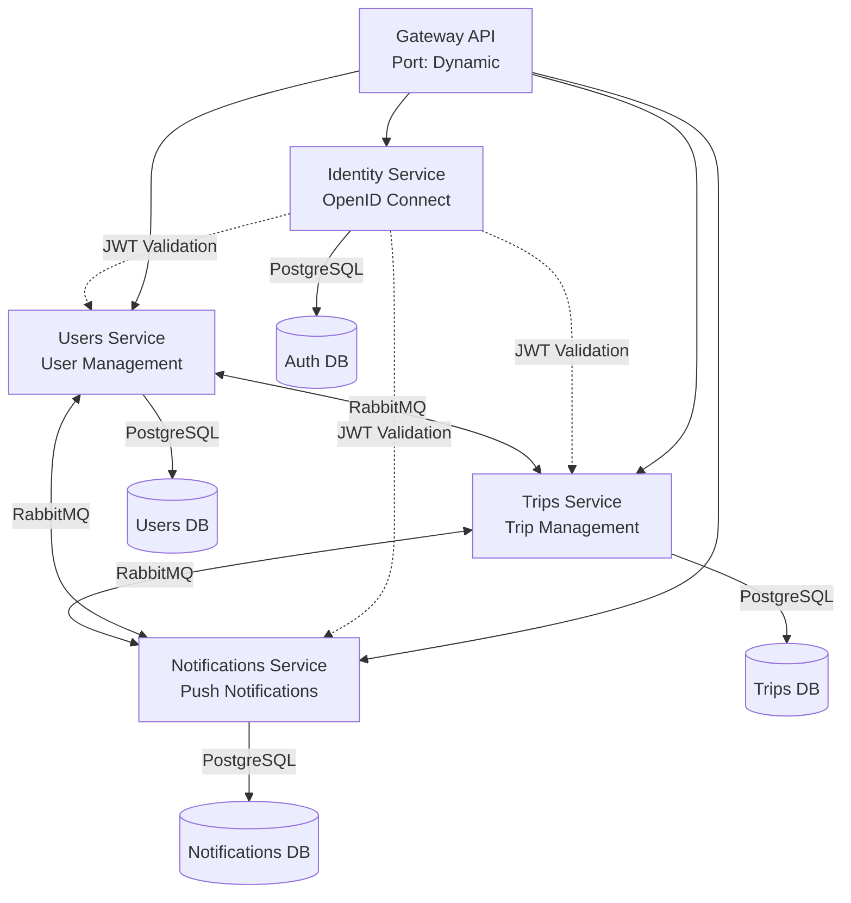

Masar Eagle follows a **microservices architecture** pattern where the application is decomposed into loosely coupled, independently deployable services. Each service owns its domain logic, data, and communicates with others through well-defined interfaces.

## Architecture Overview

The system consists of five core services orchestrated through .NET Aspire:



## Service Orchestration with .NET Aspire

The application host (`AppHost.cs`) defines the entire distributed system topology:

<CodeGroup>
```csharp src/aspire/AppHost/AppHost.cs
IDistributedApplicationBuilder builder = DistributedApplication.CreateBuilder(args);

// Infrastructure resources
IResourceBuilder<PostgresServerResource> postgres = builder.AddPostgres(Components.Postgres)
    .WithEnvironment("POSTGRES_HOST_AUTH_METHOD", "trust")
    .WithDataVolume(name: "masar-postgres-data", isReadOnly: false)
    .WithPgAdmin(pgAdmin => pgAdmin.WithHostPort(5050));

IResourceBuilder<RabbitMQServerResource> rabbitmq = builder.AddRabbitMQ(Components.RabbitMQ, username, password)
    .WithDataVolume(Components.RabbitMQConfig.DataVolumeName)
    .WithManagementPlugin(port: int.Parse(Components.RabbitMQConfig.ManagementPort));

// Core services
IResourceBuilder<ProjectResource> identityApi = builder.AddProject<Identity>(Services.Identity)
    .WithReference(authDb)
    .WithReference(rabbitmq)
    .WithEnvironment("OTEL_EXPORTER_OTLP_ENDPOINT", otelEndpoint)
    .WithExternalHttpEndpoints()
    .WaitFor(authDb)
    .WaitFor(rabbitmq);

IResourceBuilder<ProjectResource> usersApi = builder.AddProject<User>(Services.User)
    .WithReference(usersDb)
    .WithReference(rabbitmq)
    .WithReference(identityApi)  // For JWT validation
    .WaitFor(usersDb)
    .WaitFor(rabbitmq);
```
</CodeGroup>

## Core Architecture Principles

### 1. Database Per Service

Each service maintains its own dedicated PostgreSQL database:

<Accordion title="Database Isolation Example">
```csharp
// Users service has its own database
IResourceBuilder<PostgresDatabaseResource> usersDb = postgres.AddDatabase(Components.Database.User);

// Trips service has its own database
IResourceBuilder<PostgresDatabaseResource> tripsDb = postgres.AddDatabase(Components.Database.Trip);

// Notifications service has its own database
IResourceBuilder<PostgresDatabaseResource> notificationsDb = postgres.AddDatabase(Components.Database.Notifications);

// Identity service has its own database
IResourceBuilder<PostgresDatabaseResource> authDb = postgres.AddDatabase(Components.Database.Auth);
```

This ensures:
- **Data autonomy**: Each service owns its data schema
- **Independent scaling**: Services can scale their databases independently
- **Fault isolation**: Database issues don't cascade across services
- **Technology flexibility**: Services can choose different storage technologies
</Accordion>

### 2. API Gateway Pattern

The Gateway API uses **YARP (Yet Another Reverse Proxy)** to route requests to backend services:

<CodeGroup>
```csharp src/services/Gateway.Api/Program.cs
builder.Services.AddReverseProxy()
    .LoadFromConfig(builder.Configuration.GetSection("ReverseProxy"))
    .AddServiceDiscoveryDestinationResolver()
    .AddTransforms(context => context.AddXForwarded(ForwardedTransformActions.Set));

app.MapReverseProxy();
```

```json Gateway Route Configuration
{
  "ReverseProxy": {
    "Routes": {
      "connect-route": {
        "ClusterId": "identity-cluster",
        "Match": {
          "Path": "/connect/{**catch-all}"
        }
      },
      "auth-route": {
        "ClusterId": "identity-cluster",
        "Match": {
          "Path": "/api/auth/{**catch-all}"
        }
      },
      "company-profile-route": {
        "ClusterId": "users-cluster",
        "Match": {
          "Path": "/api/company/{**catch-all}"
        }
      }
    }
  }
}
```
</CodeGroup>

### 3. Service Discovery

Services discover each other using .NET Aspire's built-in service discovery:

```csharp src/services/Users/Users.Api/Program.cs
builder.Services.AddHttpClient<TripsUsageClient>("trip", 
    client => client.BaseAddress = new Uri("https+http://trip"))
    .AddServiceDiscovery();  // Automatic service resolution

builder.Services.AddHttpClient<NotificationsClient>("notifications", 
    client => client.BaseAddress = new Uri("https+http://notifications"))
    .AddServiceDiscovery();
```

<Note>
The `https+http://` scheme allows the client to prefer HTTPS but fall back to HTTP during development.
</Note>

### 4. Asynchronous Communication

Services communicate asynchronously through **RabbitMQ** using the **Wolverine** messaging framework:

```csharp src/services/Users/Users.Api/Program.cs
await builder.UseWolverineWithRabbitMqAsync(
    new WolverineMessagingOptions
    {
        EnablePostgresOutbox = true,  // Transactional outbox pattern
        PostgresConnectionName = Components.Database.User,
        OutboxSchema = "wolverine"
    },
    opts =>
    {
        opts.PublishAllMessages().ToRabbitExchange(Components.RabbitMQConfig.ExchangeName);
        
        opts.ListenToRabbitQueue("users-api-queue",
            cfg => cfg.BindExchange(Components.RabbitMQConfig.ExchangeName));
        
        opts.ApplicationAssembly = typeof(Program).Assembly;
    });
```

### 5. Observability

All services export telemetry to OpenTelemetry collectors:

```csharp Service Telemetry Configuration
builder.AddServiceDefaults();  // Adds health checks, telemetry, service discovery

.WithEnvironment("OTEL_EXPORTER_OTLP_ENDPOINT", "http://otelcollector:4317")
.WithEnvironment("OTEL_EXPORTER_OTLP_PROTOCOL", "grpc")
.WithEnvironment("OTEL_SERVICE_NAME", "user")
```

The stack includes:
- **Prometheus**: Metrics collection
- **Jaeger**: Distributed tracing
- **Loki**: Log aggregation
- **Grafana**: Unified observability dashboard

## Service Boundaries

### Domain-Driven Design

Each service represents a **bounded context**:

<CardGroup cols={2}>
  <Card title="Identity Service" icon="key">
    Authentication, authorization, token issuance
  </Card>
  <Card title="Users Service" icon="users">
    Driver, passenger, admin, vehicle, wallet management
  </Card>
  <Card title="Trips Service" icon="route">
    Trip planning, booking, seat management, payment processing
  </Card>
  <Card title="Notifications Service" icon="bell">
    Push notifications, device tokens, notification history
  </Card>
</CardGroup>

### Cross-Service Communication Patterns

<AccordionGroup>
  <Accordion title="Synchronous HTTP Calls">
    Used for **read operations** where immediate consistency is required:
    
    ```csharp
    // Users service calling Trips service
    public interface ITripsUsageClient
    {
        Task<TripUsageResult> GetDriverTripUsageAsync(string driverId);
    }
    ```
    
    <Warning>
    Avoid deep call chains that create tight coupling between services.
    </Warning>
  </Accordion>
  
  <Accordion title="Asynchronous Events">
    Used for **write operations** and **notifications**:
    
    ```csharp
    // Publishing an event
    await messageBus.PublishAsync(
        new UserAuthenticatedEvent(userId, userType, phoneNumber));
    
    // Handling an event in another service
    public class UserAuthenticatedHandler
    {
        public async Task Handle(UserAuthenticatedEvent @event)
        {
            // Provision user in local database
        }
    }
    ```
    
    Benefits:
    - **Decoupling**: Services don't need to know about consumers
    - **Reliability**: Messages are persisted until processed
    - **Scalability**: Can add new consumers without modifying publishers
  </Accordion>
  
  <Accordion title="Transactional Outbox Pattern">
    Ensures **exactly-once delivery** by persisting messages to PostgreSQL:
    
    ```csharp
    opts.PersistMessagesWithPostgresql(connectionString, "wolverine");
    ```
    
    Workflow:
    1. Message is written to `wolverine.outbox` table in same transaction as business data
    2. Background worker polls outbox and publishes to RabbitMQ
    3. Message is marked as sent only after RabbitMQ confirms
    
    This prevents message loss even if RabbitMQ is temporarily unavailable.
  </Accordion>
</AccordionGroup>

## Deployment Dependencies

Services have explicit startup dependencies defined in AppHost:

```csharp Service Dependency Chain
gatewayApi
    .WaitFor(usersApi)
    .WaitFor(tripsApi)
    .WaitFor(notificationsApi)
    .WaitFor(identityApi);

usersApi
    .WaitFor(usersDb)
    .WaitFor(rabbitmq)
    .WaitFor(identityApi);  // JWT key discovery

tripsApi
    .WaitFor(tripsDb)
    .WaitFor(rabbitmq)
    .WaitFor(usersApi);  // User validation
```

<Info>
The `WaitFor()` method ensures services start in the correct order, preventing startup failures from missing dependencies.
</Info>

## Benefits of This Architecture

<CardGroup cols={2}>
  <Card title="Independent Scaling" icon="arrows-up-down">
    Scale high-traffic services (e.g., Trips) without affecting others
  </Card>
  <Card title="Technology Diversity" icon="code">
    Use different frameworks, languages, or databases per service
  </Card>
  <Card title="Fault Isolation" icon="shield">
    Failures in one service don't cascade to others
  </Card>
  <Card title="Team Autonomy" icon="people-group">
    Teams can develop, test, and deploy services independently
  </Card>
  <Card title="Easier Maintenance" icon="screwdriver-wrench">
    Smaller codebases are easier to understand and modify
  </Card>
  <Card title="Flexible Deployment" icon="rocket">
    Deploy services independently with different release cycles
  </Card>
</CardGroup>

## Trade-offs and Challenges

<Warning>
**Increased Complexity**: Distributed systems require:
- Service discovery and health monitoring
- Distributed tracing and logging
- Network reliability and retries
- Data consistency across services
- Integration testing complexity
</Warning>

## Related Topics

<CardGroup cols={2}>
  <Card title="Services Overview" href="/concepts/services-overview" icon="sitemap">
    Detailed breakdown of each service's responsibilities
  </Card>
  <Card title="Messaging" href="/concepts/messaging" icon="message">
    RabbitMQ and Wolverine event-driven patterns
  </Card>
  <Card title="Database Schema" href="/concepts/database-schema" icon="database">
    PostgreSQL schema and migrations per service
  </Card>
  <Card title="Authentication" href="/concepts/authentication" icon="lock">
    OpenID Connect and JWT token flow
  </Card>
</CardGroup>