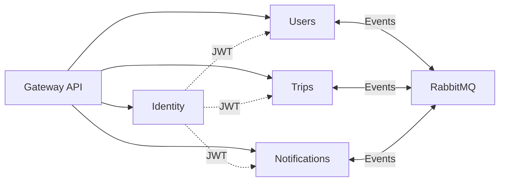

Masar Eagle consists of **five core microservices**, each responsible for a distinct business domain. This page provides a comprehensive overview of each service's purpose, API surface, and key features.

## Service Architecture Map



## 1. Gateway API

<Card title="Gateway API" icon="door-open">
  **Single entry point** for all client requests using YARP reverse proxy
</Card>

### Responsibilities

- **Route incoming requests** to appropriate backend services
- **CORS policy** enforcement
- **Request/response logging** for monitoring
- **Authentication middleware** (JWT validation)
- **Load balancing** across service instances
- **Service discovery** integration

### Key Features

<CodeGroup>
```csharp Program.cs (src/services/Gateway.Api/Program.cs:39)
builder.Services.AddReverseProxy()
    .LoadFromConfig(builder.Configuration.GetSection("ReverseProxy"))
    .AddServiceDiscoveryDestinationResolver()
    .AddTransforms(context => context.AddXForwarded(ForwardedTransformActions.Set));

app.MapReverseProxy();
```

```csharp Authentication Middleware (src/services/Gateway.Api/Program.cs:22)
builder.Services.AddAppAuthentication(builder.Configuration);

app.UseAuthentication();
app.UseAuthorization();
```
</CodeGroup>

### Route Configuration

The Gateway routes requests based on path prefixes:

| Path Pattern | Target Service | Purpose |
|-------------|----------------|----------|
| `/connect/*` | Identity | OpenID Connect token endpoint |
| `/api/auth/*` | Identity | OTP authentication |
| `/api/company/*` | Users | Company profile management |
| `/api/admin/trips/*` | Trips | Admin trip operations |
| `/api/notifications/*` | Notifications | Push notification management |

<Note>
The Gateway does NOT store any business logic or data—it's purely a routing layer.
</Note>

---

## 2. Identity Service

<Card title="Identity Service" icon="key">
  **Authentication and authorization** using OpenID Connect and OpenIddict
</Card>

### Responsibilities

- **OTP (One-Time Password) flow** for phone-based authentication
- **Password authentication** for admin and company accounts
- **JWT token issuance** and validation
- **Refresh token rotation**
- **JWKS (JSON Web Key Set) endpoint** for public key discovery
- **Token revocation and introspection**

### Authentication Flows

<AccordionGroup>
  <Accordion title="OTP Flow (Driver/Passenger)">
    <Steps>
      <Step title="Request OTP">
        Client sends phone number to `/api/auth/send-otp`
      </Step>
      <Step title="Verify OTP">
        Client submits OTP code to `/connect/token` with grant type `urn:masareagle:otp`
      </Step>
      <Step title="Issue Tokens">
        Service returns access token and refresh token
      </Step>
      <Step title="User Provisioning">
        Identity publishes `UserAuthenticatedEvent` to create user record
      </Step>
    </Steps>
    
    ```csharp src/services/Identity/src/Identity.Web/TokenEndpoint.cs:51
    private static async Task<IResult> HandleOtpGrant(
        OpenIddictRequest request,
        IOtpService otpService,
        IUserPhoneResolver phoneResolver,
        IMessageBus messageBus)
    {
        var phoneNumber = request.GetParameter("phone_number")?.ToString();
        var otpCode = request.GetParameter("otp_code")?.ToString();
        var userType = request.GetParameter("user_type")?.ToString();

        var otpResult = await otpService.VerifyOtpAsync(phoneNumber, otpCode);

        // Publish event to ensure user is provisioned
        await messageBus.PublishAsync(
            new UserAuthenticatedEvent(phoneNumber, userType, phoneNumber));

        return SignInWithIdentity(userId, userType);
    }
    ```
  </Accordion>
  
  <Accordion title="Password Flow (Admin/Company)">
    <Steps>
      <Step title="Submit Credentials">
        Client sends email and password to `/connect/token` with grant type `password`
      </Step>
      <Step title="Verify Credentials">
        Service validates credentials against Users database
      </Step>
      <Step title="Issue Tokens">
        Service returns access token and refresh token
      </Step>
    </Steps>
    
    ```csharp src/services/Identity/src/Identity.Web/TokenEndpoint.cs:122
    private static async Task<IResult> HandlePasswordGrant(
        OpenIddictRequest request,
        IUserCredentialVerifier credentialVerifier)
    {
        var userType = request.GetParameter("user_type")?.ToString();

        return userType switch
        {
            not (UserTypes.Admin or UserTypes.Company) =>
                ForbidWithError(Errors.InvalidGrant, 
                    "نوع المستخدم غير مدعوم لتسجيل الدخول بكلمة مرور"),
            _ => await VerifyCredentials(request.Username!, 
                    request.Password!, userType, credentialVerifier)
        };
    }
    ```
  </Accordion>
  
  <Accordion title="Refresh Token Flow">
    All user types can refresh their access tokens:
    
    ```csharp src/services/Identity/src/Identity.Web/TokenEndpoint.cs:152
    private static async Task<IResult> HandleRefreshGrant(HttpContext context)
    {
        var result = await context.AuthenticateAsync(
            OpenIddictServerAspNetCoreDefaults.AuthenticationScheme);

        return result.Succeeded 
            ? RefreshIdentity(result.Principal!)
            : ForbidWithError(Errors.InvalidGrant, 
                "رمز التحديث غير صالح أو منتهي الصلاحية");
    }
    ```
  </Accordion>
</AccordionGroup>

### Token Configuration

```csharp src/services/Identity/src/Identity.Web/OpenIddictServerConfiguration.cs:19
options.SetTokenEndpointUris("connect/token")
       .SetRevocationEndpointUris("connect/revocation")
       .SetIntrospectionEndpointUris("connect/introspect");

options.AllowPasswordFlow()
       .AllowRefreshTokenFlow()
       .AllowCustomFlow("urn:masareagle:otp");

options.SetAccessTokenLifetime(TimeSpan.FromMinutes(jwt.AccessTokenExpiryMinutes));
options.SetRefreshTokenLifetime(TimeSpan.FromDays(30));
```

<Info>
Access tokens expire after a configurable duration (default: minutes), while refresh tokens last 30 days.
</Info>

---

## 3. Users Service

<Card title="Users Service" icon="users">
  **User management** for drivers, passengers, admins, companies, and vehicles
</Card>

### Responsibilities

- **Driver profiles**: Documents, vehicle info, verification status, ratings
- **Passenger profiles**: Personal info, wallet, booking history
- **Admin accounts**: Email/password authentication, permissions
- **Company profiles**: Fleet management, driver assignment
- **Vehicle management**: Types, images, seat configurations
- **Wallet operations**: Deposits, withdrawals, balance tracking
- **File storage**: Profile pictures, identity documents

### Database Schema

The Users service maintains these tables:

```csharp src/services/Users/Users.Api/Infrastructure/Migrations/202501070001_InitialSchema.cs:12
CreateTableWithStandardColumns("Drivers", table => table
    .WithColumn("PhoneNumber").AsString(450).NotNullable().Unique()
    .WithColumn("FullName").AsString(256).Nullable()
    .WithColumn("ProfilePictureUrl").AsString().Nullable()
    .WithColumn("IdentityDocumentUrl").AsString().Nullable()
    .WithColumn("DrivingLicenseUrl").AsString().Nullable()
    .WithColumn("IsPhoneVerified").AsBoolean().NotNullable()
    .WithColumn("IsProfileComplete").AsBoolean().NotNullable()
    .WithColumn("IsActive").AsBoolean().NotNullable()
);

CreateTableWithStandardColumns("Passengers", table => table
    .WithColumn("PhoneNumber").AsString(450).NotNullable().Unique()
    .WithColumn("FullName").AsString(256).Nullable()
    .WithColumn("Gender").AsInt32().NotNullable()
    .WithColumn("ProfilePictureUrl").AsString().Nullable()
);

CreateTableWithStandardColumns("Vehicles", table => table
    .WithColumn("Name").AsString(256).NotNullable()
    .WithColumn("Model").AsString(256).NotNullable()
    .WithColumn("VehicleTypeId").AsString(450).NotNullable()
    .WithColumn("DriverId").AsString(450).NotNullable()
);
```

### Key Features

<CardGroup cols={2}>
  <Card title="Background Jobs" icon="clock">
    Account purge worker for inactive accounts
    
    ```csharp src/services/Users/Users.Api/Program.cs:70
    builder.Services.AddHostedService<AccountPurgeWorker>();
    ```
  </Card>
  
  <Card title="File Storage" icon="folder">
    Local file storage with compression for profile images and documents
    
    ```csharp
    builder.Services.AddResponseCompression(options =>
    {
        options.EnableForHttps = true;
        options.Providers.Add<BrotliCompressionProvider>();
        options.Providers.Add<GzipCompressionProvider>();
    });
    ```
  </Card>
  
  <Card title="Service Clients" icon="link">
    HTTP clients for calling Trips and Notifications services
    
    ```csharp src/services/Users/Users.Api/Program.cs:72
    builder.Services.AddHttpClient<TripsUsageClient>("trip", 
        client => client.BaseAddress = new Uri("https+http://trip"))
        .AddServiceDiscovery();
    ```
  </Card>
  
  <Card title="Wolverine Outbox" icon="inbox">
    Transactional outbox for reliable messaging
    
    ```csharp src/services/Users/Users.Api/Program.cs:116
    await builder.UseWolverineWithRabbitMqAsync(
        new WolverineMessagingOptions
        {
            EnablePostgresOutbox = true,
            PostgresConnectionName = Components.Database.User,
            OutboxSchema = "wolverine"
        },
        opts => opts.ListenToRabbitQueue("users-api-queue")
    );
    ```
  </Card>
</CardGroup>

---

## 4. Trips Service

<Card title="Trips Service" icon="route">
  **Trip planning, booking, and payment** for individual and company trips
</Card>

### Responsibilities

- **Trip creation and scheduling**: Departure/arrival times, stops, pricing
- **Seat booking management**: Passenger reservations, seat assignments
- **Payment processing**: Moyasar integration, wallet deductions, refunds
- **Trip lifecycle**: Scheduled → Started → Completed → Cancelled states
- **Company bookings**: Fleet trips with driver assignment
- **Public trip search**: Location-based, time-based, unified search strategies
- **Background jobs**: Trip reminders, automatic cancellations
- **Rating system**: Driver and passenger ratings

### Database Schema

```csharp src/services/Trips/Trips.Api/Infrastructure/Migrations/202501070002_CreateTripsTableOnly.cs:14
Create.Table("trips")
    .WithColumn("id").AsString(450).PrimaryKey()
    .WithColumn("from_city").AsString(450).NotNullable()
    .WithColumn("to_city").AsString(450).NotNullable()
    .WithColumn("departure_time_utc").AsDateTimeOffset().NotNullable()
    .WithColumn("arrival_time_utc").AsDateTimeOffset().Nullable()
    .WithColumn("price").AsDecimal(10, 2).NotNullable()
    .WithColumn("status").AsString(50).NotNullable()
    .WithColumn("available_seats").AsInt32().NotNullable()
    .WithColumn("total_seats").AsInt32().NotNullable()
    .WithColumn("vehicle_id").AsString(450).NotNullable()
    .WithColumn("driver_id").AsString(450).NotNullable();

Create.Table("seat_bookings")
    .WithColumn("id").AsString(450).PrimaryKey()
    .WithColumn("trip_id").AsString(450).NotNullable()
    .WithColumn("seat_number").AsInt32().NotNullable()
    .WithColumn("passenger_id").AsString(450).NotNullable()
    .WithColumn("passenger_name").AsString(256).NotNullable()
    .WithColumn("status").AsString(50).NotNullable();
```

### Key Features

<Tabs>
  <Tab title="Hangfire Jobs">
    Background job scheduling for trip reminders and auto-cancellations:
    
    ```csharp src/services/Trips/Trips.Api/Program.cs:115
    builder.Services.AddHangfire(config => config
        .SetDataCompatibilityLevel(CompatibilityLevel.Version_180)
        .UseRecommendedSerializerSettings()
        .UseMemoryStorage());

    builder.Services.AddHangfireServer(options =>
    {
        options.Queues = ["default", "notifications"];
        options.WorkerCount = Environment.ProcessorCount * 5;
    });

    builder.Services.AddHostedService<HangfireStartupService>();
    ```
  </Tab>
  
  <Tab title="Payment Integration">
    Moyasar payment gateway integration for online payments:
    
    ```csharp src/services/Trips/Trips.Api/Program.cs:105
    builder.AddMoyasarPaymentServices();

    builder.Services.AddScoped<IMoyasarVerificationService, MoyasarVerificationService>();
    builder.Services.AddScoped<ICompanyBookingPaymentService, CompanyBookingPaymentService>();
    ```
  </Tab>
  
  <Tab title="Search Strategies">
    Strategy pattern for different trip search types:
    
    ```csharp src/services/Trips/Trips.Api/Program.cs:133
    builder.Services.AddScoped<ITripSearchStrategy, DriverTripSearchStrategy>();
    builder.Services.AddScoped<ITripSearchStrategy, CompanyTripSearchStrategy>();
    ```
  </Tab>
  
  <Tab title="Wolverine Routing">
    Selective message routing to specific queues:
    
    ```csharp src/services/Trips/Trips.Api/Program.cs:136
    await builder.UseWolverineWithRabbitMqAsync(opts =>
    {
        opts.PublishMessage<UpdateDriverRatingCommand>()
            .ToRabbitQueue("users-api-queue");
        opts.PublishMessage<UpdatePassengerRatingCommand>()
            .ToRabbitQueue("users-api-queue");
        
        opts.ListenToRabbitQueue("trips-api-queue",
            cfg => cfg.BindExchange(Components.RabbitMQConfig.ExchangeName));
    });
    ```
  </Tab>
</Tabs>

---

## 5. Notifications Service

<Card title="Notifications Service" icon="bell">
  **Push notifications** via Firebase Cloud Messaging (FCM)
</Card>

### Responsibilities

- **Device token registration**: iOS, Android device tokens
- **Push notification delivery**: Firebase Cloud Messaging integration
- **Notification history**: Persistent storage of sent notifications
- **Batch notifications**: Multi-device sending
- **Admin notification forwarding**: Copy notifications to admin dashboard
- **Read/unread tracking**: Notification status management

### Database Schema

```csharp src/services/Notifications/Notifications.Api/Infrastructure/Migrations/202501070024_CreateDeviceTokensTable.cs:15
Create.Table("device_tokens")
    .WithColumn("id").AsString(450).PrimaryKey()
    .WithColumn("user_id").AsString(450).NotNullable()
    .WithColumn("user_type").AsString(50).NotNullable()
    .WithColumn("device_token").AsString(500).NotNullable()
    .WithColumn("platform").AsString(50).Nullable()
    .WithColumn("app_version").AsString(20).Nullable()
    .WithColumn("is_active").AsBoolean().NotNullable();

Create.UniqueConstraint("UQ_device_tokens_user_token").OnTable("device_tokens")
    .Columns("user_id", "device_token");
```

### Event-Driven Architecture

Notifications are triggered by events from other services:

```csharp src/services/Notifications/Notifications.Api/Handlers/NotificationHandler.cs:14
private static async Task HandleNotification(
    NotificationMessage notification,
    FirebaseNotificationService firebaseService,
    IDeviceTokenRepository deviceTokenRepository,
    AppDataConnection db,
    ILogger logger)
{
    // Fetch device tokens for recipient
    List<string> deviceTokens = await deviceTokenRepository
        .GetActiveTokensAsync(notification.RecipientId, cancellationToken);

    // Send to Firebase
    int successCount = await firebaseService.SendBatchAsync(
        deviceTokens,
        notification.Title,
        notification.Body,
        notification.Data,
        cancellationToken);

    // Save to notification history
    await SaveNotificationToHistory(notification, db, cancellationToken);

    // Forward to admin if applicable
    if (shouldSendToAdmin)
    {
        await SendNotificationToAdminAsync(...);
    }
}
```

### Wolverine Configuration

```csharp src/services/Notifications/Notifications.Api/Program.cs:74
await builder.UseWolverineWithRabbitMqAsync(opts =>
{
    opts.ListenToRabbitQueue(Components.RabbitMQConfig.QueueName,
        cfg => cfg.BindExchange(Components.RabbitMQConfig.ExchangeName));
    opts.ApplicationAssembly = typeof(Program).Assembly;
});
```

<Note>
Notifications service is a **pure consumer**—it only listens to events and doesn't publish any.
</Note>

---

## Service Communication Matrix

| Service | Identity | Users | Trips | Notifications |
|---------|----------|-------|-------|---------------|
| **Identity** | - | Validates credentials (HTTP) | - | - |
| **Users** | Publishes auth events | - | Queries trip usage (HTTP) | Sends notifications (Event) |
| **Trips** | - | Queries user data (HTTP), Updates ratings (Event) | - | Sends trip events (Event) |
| **Notifications** | - | Queries user info (HTTP) | - | - |

## Service Health and Monitoring

All services expose health check endpoints:

```csharp
builder.Services.AddHealthChecks();

app.MapDefaultEndpoints();  // Adds /health, /alive, /ready
```

Health checks are monitored by:
- **.NET Aspire Dashboard**: Real-time service status
- **Prometheus**: Metrics scraping
- **Grafana**: Visualization and alerts

## Related Topics

<CardGroup cols={2}>
  <Card title="Microservices Architecture" href="/concepts/microservices-architecture" icon="diagram-project">
    Overall architecture patterns and principles
  </Card>
  <Card title="Authentication" href="/concepts/authentication" icon="lock">
    Deep dive into Identity service flows
  </Card>
  <Card title="Messaging" href="/concepts/messaging" icon="message">
    RabbitMQ and Wolverine event patterns
  </Card>
  <Card title="Database Schema" href="/concepts/database-schema" icon="database">
    Detailed schema for each service
  </Card>
</CardGroup>