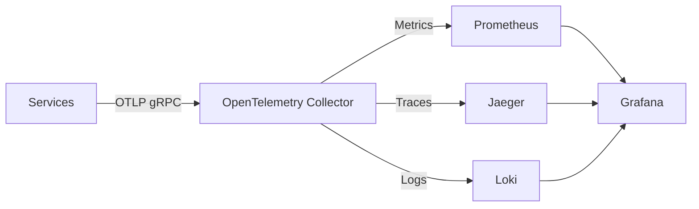

## Overview

Masar Eagle uses a complete observability stack built on OpenTelemetry, Prometheus, Grafana, and Jaeger. All services automatically export metrics, traces, and logs through the OpenTelemetry Collector.

## Architecture

The monitoring stack follows this data flow:



## OpenTelemetry Configuration

### Service Instrumentation

All services are instrumented through the `ServiceDefaults` package (src/aspire/ServiceDefaults/Extensions.cs:34-73):

```csharp
builder.Services.AddOpenTelemetry()
    .ConfigureResource(resource => resource
        .AddService(serviceName: serviceName)
        .AddAttributes(new Dictionary<string, object>
        {
            ["service.name"] = serviceName,
            ["deployment.environment"] = builder.Environment.EnvironmentName
        }))
    .WithMetrics(metrics => metrics
        .AddAspNetCoreInstrumentation()
        .AddHttpClientInstrumentation()
        .AddRuntimeInstrumentation())
    .WithTracing(tracing => tracing
        .AddSource(builder.Environment.ApplicationName)
        .AddAspNetCoreInstrumentation()
        .AddHttpClientInstrumentation()
        .AddGrpcClientInstrumentation());
```

### Collector Configuration

The OpenTelemetry Collector (src/aspire/otelcollector/config.yaml) receives telemetry on multiple protocols:

<CodeGroup>
```yaml Receivers
receivers:
  otlp:
    protocols:
      grpc:
        endpoint: 0.0.0.0:4317
      http:
        endpoint: 0.0.0.0:4318
```

```yaml Exporters
exporters:
  otlphttp/prometheus:
    endpoint: ${env:PROMETHEUS_ENDPOINT}
    tls:
      insecure: true
  otlp/jaeger:
    endpoint: ${env:JAEGER_ENDPOINT}
    tls:
      insecure: true
  otlphttp/loki:
    endpoint: ${env:LOKI_ENDPOINT}
    tls:
      insecure: true
```

```yaml Pipelines
service:
  pipelines:
    traces:
      receivers: [otlp]
      processors: [batch]
      exporters: [debug, otlp/jaeger]
    logs:
      receivers: [otlp]
      processors: [batch]
      exporters: [debug, otlphttp/loki]
    metrics:
      receivers: [otlp]
      processors: [batch]
      exporters: [debug, otlphttp/prometheus]
```
</CodeGroup>

## Prometheus Setup

### Configuration

Prometheus (src/aspire/prometheus/prometheus.yml) runs in OTLP receiver mode:

```yaml
storage:
  tsdb:
    out_of_order_time_window: 30m

otlp:

scrape_configs:
  # No scrape configs - using OTLP receiver mode
```

### Service Metrics

Each service automatically exports:

<CardGroup cols={2}>
  <Card title="ASP.NET Core Metrics" icon="gauge">
    - HTTP request duration
    - Active requests
    - Failed requests
    - Response sizes
  </Card>
  <Card title="Runtime Metrics" icon="microchip">
    - GC collections
    - Memory allocations
    - Thread pool usage
    - Exception counts
  </Card>
  <Card title="HTTP Client Metrics" icon="arrow-right-arrow-left">
    - Outbound request duration
    - Connection pool stats
    - Failed requests
    - DNS lookup time
  </Card>
  <Card title="Custom Metrics" icon="chart-line">
    - Error counters by type
    - Error duration histogram
    - Business metrics
  </Card>
</CardGroup>

### Custom Error Metrics

The `GlobalExceptionMiddleware` (src/BuildingBlocks/Common/Middleware/GlobalExceptionMiddleware.cs:17-25) records detailed error metrics:

```csharp
private static readonly Counter<long> ErrorCounter = ErrorMeter.CreateCounter<long>(
    "errors_total",
    "count",
    "Total number of errors by type and status code");

private static readonly Histogram<double> ErrorDuration = ErrorMeter.CreateHistogram<double>(
    "error_duration_seconds",
    "seconds",
    "Time taken to handle errors");
```

Tags include:
- `exception_type`: Exception class name
- `error_category`: ValidationError, AuthenticationError, BusinessLogicError, etc.
- `status_code`: HTTP status code
- `service`: Service name
- `is_client_error`: true/false

## Grafana Dashboards

### Data Sources

Grafana (src/aspire/grafana/config/provisioning/datasources/default.yaml) is pre-configured with three data sources:

```yaml
datasources:
  - name: Prometheus
    type: prometheus
    url: $PROMETHEUS_ENDPOINT
    uid: PBFA97CFB590B2093
  - name: Loki
    type: loki
    url: $LOKI_ENDPOINT
  - name: Jaeger
    type: jaeger
    url: $JAEGER_ENDPOINT
```

### Pre-installed Dashboards

The platform includes three pre-configured dashboards:

<CardGroup cols={3}>
  <Card title="ASP.NET Core" icon="chart-mixed">
    Overall service health, request rates, error rates, and response times
  </Card>
  <Card title="ASP.NET Core Endpoints" icon="diagram-project">
    Per-endpoint metrics including latency percentiles and throughput
  </Card>
  <Card title="Loki Logs" icon="file-lines">
    Log aggregation with filtering, search, and pattern detection
  </Card>
</CardGroup>

### Dashboard Provisioning

Dashboards are automatically loaded from (src/aspire/grafana/config/provisioning/dashboards/default.yaml):

```yaml
providers:
  - name: Default
    folder: Default
    type: file
    options:
      path: /var/lib/grafana/dashboards
```

## Service Configuration

### AppHost Setup

The observability stack is configured in AppHost.cs (src/aspire/AppHost/AppHost.cs:25-88):

<Steps>
  <Step title="OpenTelemetry Collector">
    ```csharp
    IResourceBuilder<OpenTelemetryCollectorResource> otelCollector = 
        builder.AddOpenTelemetryCollector("otelcollector", "../otelcollector/config.yaml");
    
    string otelEndpoint = "http://otelcollector:4317";
    ```
  </Step>

  <Step title="Prometheus">
    ```csharp
    IResourceBuilder<ContainerResource> prometheus = 
        builder.AddContainer("prometheus", "prom/prometheus", "v3.2.1")
        .WithBindMount("../prometheus", "/etc/prometheus", isReadOnly: true)
        .WithArgs("--web.enable-otlp-receiver", "--config.file=/etc/prometheus/prometheus.yml")
        .WithHttpEndpoint(targetPort: 9090, name: "http");
    ```
  </Step>

  <Step title="Jaeger">
    ```csharp
    IResourceBuilder<ContainerResource> jaeger = 
        builder.AddContainer("jaeger", "jaegertracing/jaeger:latest")
        .WithBindMount("../jaeger/config.yaml", "/jaeger/config.yaml", isReadOnly: true)
        .WithEndpoint(port: 16686, targetPort: 16686, scheme: "http", name: "http", isExternal: true)
        .WithEndpoint(port: 4317, targetPort: 4317, name: "grpc-collector");
    ```
  </Step>

  <Step title="Grafana">
    ```csharp
    IResourceBuilder<ContainerResource> grafana = 
        builder.AddContainer("grafana", "grafana/grafana")
        .WithBindMount("../grafana/config", "/etc/grafana", isReadOnly: true)
        .WithBindMount("../grafana/dashboards", "/var/lib/grafana/dashboards", isReadOnly: true)
        .WithEnvironment("PROMETHEUS_ENDPOINT", prometheus.GetEndpoint("http"))
        .WithEnvironment("LOKI_ENDPOINT", loki.GetEndpoint("http"))
        .WithEnvironment("JAEGER_ENDPOINT", jaeger.GetEndpoint("http"))
        .WithHttpEndpoint(targetPort: 3000, name: "http");
    ```
  </Step>

  <Step title="Service OTLP Configuration">
    Each service gets OTLP configuration:
    ```csharp
    builder.AddProject<User>(Services.User)
        .WithEnvironment("OTEL_EXPORTER_OTLP_ENDPOINT", otelEndpoint)
        .WithEnvironment("OTEL_EXPORTER_OTLP_PROTOCOL", "grpc")
        .WithEnvironment("OTEL_SERVICE_NAME", "user")
        .WaitFor(otelCollector);
    ```
  </Step>
</Steps>

## Accessing Dashboards

<CardGroup cols={3}>
  <Card title="Grafana" icon="chart-line" href="http://localhost:3000">
    Unified visualization platform
  </Card>
  <Card title="Prometheus" icon="database" href="http://localhost:9090">
    Metrics storage and queries
  </Card>
  <Card title="Jaeger" icon="diagram-project" href="http://localhost:16686">
    Distributed tracing UI
  </Card>
</CardGroup>

## Query Examples

### PromQL Queries

<AccordionGroup>
  <Accordion title="Request Rate by Service">
    ```promql
    rate(http_server_request_duration_seconds_count{service_name=~"user|trip|gateway"}[5m])
    ```
  </Accordion>

  <Accordion title="95th Percentile Latency">
    ```promql
    histogram_quantile(0.95, 
      rate(http_server_request_duration_seconds_bucket[5m])
    )
    ```
  </Accordion>

  <Accordion title="Error Rate by Type">
    ```promql
    sum by (exception_type, service) (
      rate(errors_total[5m])
    )
    ```
  </Accordion>

  <Accordion title="Memory Usage">
    ```promql
    process_runtime_dotnet_gc_heap_size_bytes{service_name="user"}
    ```
  </Accordion>
</AccordionGroup>

## Health Checks

All services expose health check endpoints (src/aspire/ServiceDefaults/Extensions.cs:75-96):

```csharp
builder.Services.AddHealthChecks()
    .AddCheck("self", () => HealthCheckResult.Healthy(), ["live"]);
```

<CodeGroup>
```bash Health Endpoint
curl http://localhost:8080/health
```

```bash Liveness Check
curl http://localhost:8080/alive
```
</CodeGroup>

<Info>
Health checks are only exposed in Development mode for security.
</Info>

## Best Practices

<CardGroup cols={2}>
  <Card title="Use Structured Logging" icon="list">
    All logs include structured metadata for better filtering in Grafana
  </Card>
  <Card title="Add Custom Spans" icon="timeline">
    Use `ActivitySource` to add custom trace spans for business operations
  </Card>
  <Card title="Monitor Error Categories" icon="triangle-exclamation">
    Track error categories (ValidationError, AuthenticationError, etc.) separately
  </Card>
  <Card title="Set SLO Alerts" icon="bell">
    Configure Grafana alerts for SLO violations (error rate, latency)
  </Card>
</CardGroup>

## Next Steps

<CardGroup cols={2}>
  <Card title="Logging" icon="file-lines" href="./logging">
    Configure Loki logging and log levels
  </Card>
  <Card title="Troubleshooting" icon="wrench" href="./troubleshooting">
    Common issues and debugging strategies
  </Card>
</CardGroup>