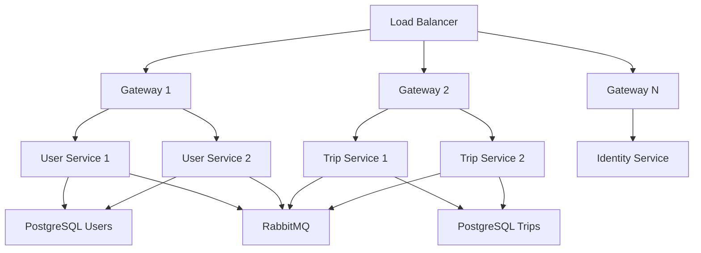
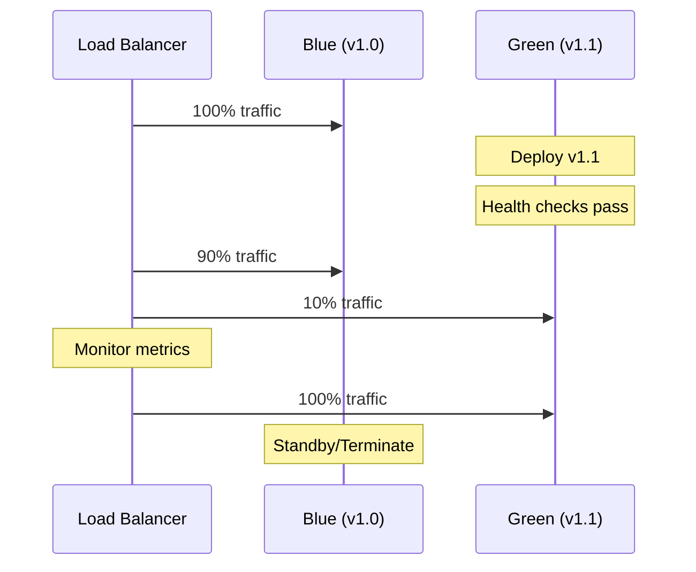

## Overview

Masar Eagle is designed as a distributed microservices architecture that can scale horizontally. This guide covers scaling strategies, performance optimization, and capacity planning.

## Architecture Scalability

### Service Independence

Each service can scale independently:



### Stateless Services

All API services are stateless, enabling easy horizontal scaling:
- No in-memory session state
- JWT-based authentication (no server-side sessions)
- Shared database for persistence
- Message queue for asynchronous communication

## Scaling Strategies

### Horizontal Scaling

<Steps>
  <Step title="Gateway Layer">
    Scale the Gateway service to handle more concurrent requests:
    ```yaml
    # docker-compose.yml
    gateway:
      image: masaregle/gateway:latest
      deploy:
        replicas: 3
        resources:
          limits:
            cpus: '1.0'
            memory: 512M
    ```
  </Step>

  <Step title="API Services">
    Scale individual services based on load:
    ```yaml
    user-service:
      deploy:
        replicas: 2  # Moderate traffic
    
    trip-service:
      deploy:
        replicas: 4  # High traffic
    
    identity-service:
      deploy:
        replicas: 2  # Auth traffic
    ```
  </Step>

  <Step title="Load Balancing">
    Use YARP reverse proxy with service discovery (Gateway.Api/Program.cs:39-42):
    ```csharp
    builder.Services.AddReverseProxy()
        .LoadFromConfig(builder.Configuration.GetSection("ReverseProxy"))
        .AddServiceDiscoveryDestinationResolver()
        .AddTransforms(context => context.AddXForwarded(ForwardedTransformActions.Set));
    ```
  </Step>
</Steps>

### Database Scaling

<AccordionGroup>
  <Accordion title="Read Replicas">
    Configure PostgreSQL read replicas for read-heavy workloads:
    
    ```csharp
    // Add read-only connection string
    services.AddDbContext<AppDbContext>(options =>
    {
        if (isReadOnlyOperation)
            options.UseNpgsql(readReplicaConnectionString);
        else
            options.UseNpgsql(primaryConnectionString);
    });
    ```

    **Use Cases:**
    - Trip search queries
    - Report generation
    - Analytics queries
    - Admin dashboard data
  </Accordion>

  <Accordion title="Connection Pooling">
    PostgreSQL connection pooling is enabled by default in Npgsql:
    
    ```
    Server=postgres;Database=users;Pooling=true;MinPoolSize=5;MaxPoolSize=100;
    ```

    **Tuning:**
    - `MinPoolSize`: Keep connections warm (5-10)
    - `MaxPoolSize`: Limit per service instance (50-100)
    - Monitor: `npgsql_connection_pools_num_connections`
  </Accordion>

  <Accordion title="Database Sharding">
    Consider sharding for very high scale:
    
    **By Geography:**
    - Separate databases per region/city
    - Users/Trips partitioned by zone
    
    **By Entity Type:**
    - Already separated: Users, Trips, Notifications, Auth
    - Can further split if individual databases grow large
  </Accordion>

  <Accordion title="Indexing Strategy">
    Key indexes for performance:
    
    ```sql
    -- Trips table
    CREATE INDEX idx_trips_status ON trips(status);
    CREATE INDEX idx_trips_driver_id ON trips(driver_id);
    CREATE INDEX idx_trips_departure_time ON trips(departure_time);
    CREATE INDEX idx_trips_zone_id ON trips(zone_id);
    
    -- Users table
    CREATE INDEX idx_users_email ON users(email);
    CREATE INDEX idx_users_phone ON users(phone_number);
    CREATE INDEX idx_users_role ON users(role);
    
    -- Composite indexes
    CREATE INDEX idx_trips_status_departure ON trips(status, departure_time);
    CREATE INDEX idx_trips_zone_status ON trips(zone_id, status);
    ```
  </Accordion>
</AccordionGroup>

### Message Queue Scaling

<AccordionGroup>
  <Accordion title="RabbitMQ Clustering">
    Scale RabbitMQ for high message throughput:
    
    ```yaml
    rabbitmq:
      image: rabbitmq:3-management
      environment:
        RABBITMQ_CLUSTER_NODES: rabbit@node1,rabbit@node2,rabbit@node3
      deploy:
        replicas: 3
    ```

    **Benefits:**
    - High availability
    - Message distribution
    - Increased throughput
  </Accordion>

  <Accordion title="Queue Configuration">
    Optimize queue settings (AppHost.cs:21-23):
    
    ```csharp
    builder.AddRabbitMQ(Components.RabbitMQ, username, password)
        .WithDataVolume(Components.RabbitMQConfig.DataVolumeName)
        .WithManagementPlugin(port: int.Parse(Components.RabbitMQConfig.ManagementPort));
    ```

    **Production Settings:**
    - Enable lazy queues for large queues
    - Set message TTL for transient messages
    - Configure dead letter exchanges
    - Use quorum queues for critical data
  </Accordion>

  <Accordion title="Wolverine Outbox">
    Transactional outbox ensures reliable messaging (Program.cs:116-122):
    
    ```csharp
    await builder.UseWolverineWithRabbitMqAsync(
        new WolverineMessagingOptions
        {
            EnablePostgresOutbox = true,
            PostgresConnectionName = Components.Database.User,
            OutboxSchema = "wolverine"
        },
        ...
    );
    ```

    **Scaling Consideration:**
    - Outbox polling can be CPU-intensive
    - Adjust polling interval based on message volume
    - Monitor outbox table size
  </Accordion>
</AccordionGroup>

## Performance Optimization

### Response Compression

Compression is enabled by default (Users.Api/Program.cs:41-55):

```csharp
builder.Services.AddResponseCompression(options =>
{
    options.EnableForHttps = true;
    options.Providers.Add<BrotliCompressionProvider>();
    options.Providers.Add<GzipCompressionProvider>();
    options.MimeTypes = ResponseCompressionDefaults.MimeTypes.Concat(new[]
    {
        "application/json",
        "text/json"
    });
});

builder.Services.Configure<BrotliCompressionProviderOptions>(
    options => options.Level = CompressionLevel.Fastest);
```

**Impact:**
- 60-80% reduction in JSON response size
- Lower bandwidth costs
- Faster mobile client performance

### Caching Strategy

<CardGroup cols={2}>
  <Card title="HTTP Response Caching" icon="clock">
    Add response caching for static data:
    ```csharp
    app.MapGet("/api/cities", async (DbContext db) => 
        await db.Cities.ToListAsync())
        .CacheOutput(policy => policy.Expire(TimeSpan.FromHours(1)));
    ```
  </Card>

  <Card title="Distributed Cache" icon="server">
    Use Redis for shared cache:
    ```csharp
    builder.Services.AddStackExchangeRedisCache(options =>
    {
        options.Configuration = "redis:6379";
        options.InstanceName = "MasarEagle_";
    });
    ```
  </Card>

  <Card title="In-Memory Caching" icon="memory">
    Cache configuration data:
    ```csharp
    services.AddMemoryCache();
    
    cache.GetOrCreate("AppSettings", entry =>
    {
        entry.AbsoluteExpirationRelativeToNow = TimeSpan.FromMinutes(15);
        return LoadAppSettings();
    });
    ```
  </Card>

  <Card title="EF Core Query Caching" icon="database">
    Queries are automatically cached:
    ```csharp
    // Compiled query - cached once, reused
    var query = EF.CompileQuery(
        (DbContext db, int id) => db.Users.Find(id)
    );
    ```
  </Card>
</CardGroup>

### Background Jobs

Hangfire is configured for background processing (Trips.Api/Program.cs:115-127):

```csharp
builder.Services.AddHangfire(config => config
    .SetDataCompatibilityLevel(CompatibilityLevel.Version_180)
    .UseSimpleAssemblyNameTypeSerializer()
    .UseRecommendedSerializerSettings()
    .UseMemoryStorage());

builder.Services.AddHangfireServer(options =>
{
    options.Queues = ["default", "notifications"];
    options.WorkerCount = Environment.ProcessorCount * 5;
});
```

<Warning>
**Memory Storage:** Current configuration uses in-memory storage. For production:
- Use PostgreSQL storage: `UsePostgreSqlStorage()`
- Prevents job loss on restart
- Enables distributed job execution
</Warning>

**Job Examples:**
- Trip reminders (TripReminder cron: `*/5 * * * *`)
- Auto-cancel overdue trips (AutoCancel cron: `*/10 * * * *`)
- Account purge (AccountPurgeWorker)

### Request Size Limits

Large file uploads are supported (Users.Api/Program.cs:26-33):

```csharp
builder.WebHost.ConfigureKestrel(options => 
    options.Limits.MaxRequestBodySize = null);

builder.Services.Configure<FormOptions>(options =>
{
    options.MultipartBodyLengthLimit = long.MaxValue;
    options.ValueLengthLimit = int.MaxValue;
    options.ValueCountLimit = int.MaxValue; 
});
```

**Production Recommendations:**
- Set reasonable limits (e.g., 10MB for images)
- Use streaming for large files
- Offload to object storage (S3, Azure Blob)
- Implement chunked uploads for >5MB

## Monitoring for Scale

### Key Metrics

<Tabs>
  <Tab title="Service Metrics">
    ```promql
    # Request rate
    rate(http_server_request_duration_seconds_count[5m])
    
    # Error rate
    rate(errors_total[5m])
    
    # Latency (p95)
    histogram_quantile(0.95, rate(http_server_request_duration_seconds_bucket[5m]))
    
    # Active requests
    http_server_active_requests
    ```
  </Tab>

  <Tab title="Database Metrics">
    ```promql
    # Connection pool usage
    npgsql_connection_pools_num_connections
    
    # Active connections
    pg_stat_activity_count
    
    # Query duration
    pg_stat_statements_mean_time_seconds
    
    # Database size
    pg_database_size_bytes
    ```
  </Tab>

  <Tab title="Queue Metrics">
    ```promql
    # Queue depth
    rabbitmq_queue_messages
    
    # Message rate
    rate(rabbitmq_queue_messages_published_total[5m])
    
    # Consumer count
    rabbitmq_queue_consumers
    
    # Unacked messages
    rabbitmq_queue_messages_unacked
    ```
  </Tab>

  <Tab title="Runtime Metrics">
    ```promql
    # Memory
    process_runtime_dotnet_gc_heap_size_bytes
    
    # CPU
    process_cpu_seconds_total
    
    # Thread pool
    process_runtime_dotnet_thread_pool_threads_count
    
    # GC collections
    process_runtime_dotnet_gc_collections_count
    ```
  </Tab>
</Tabs>

### SLO Targets

| Metric | Target | Critical Threshold |
|--------|--------|-------------------|
| Availability | Greater than 99.9% | Less than 99% |
| P95 Latency | Less than 500ms | Greater than 2s |
| Error Rate | Less than 1% | Greater than 5% |
| Database Conn Pool | Less than 80% | Greater than 95% |
| Queue Lag | Less than 100 msgs | Greater than 1000 msgs |

## Capacity Planning

### Resource Estimates

<AccordionGroup>
  <Accordion title="Per Service Instance">
    **Minimum Resources:**
    - CPU: 0.5 cores
    - Memory: 256MB
    - Disk: 100MB

    **Recommended (Production):**
    - CPU: 1-2 cores
    - Memory: 512MB-1GB
    - Disk: 1GB (for logs)

    **Capacity:**
    - ~200-500 req/sec per instance
    - Scales linearly with CPU
  </Accordion>

  <Accordion title="PostgreSQL">
    **Sizing:**
    ```
    connections = (num_cpu_cores * 2) + effective_spindle_count
    shared_buffers = 25% of RAM
    effective_cache_size = 50% of RAM
    work_mem = (RAM - shared_buffers) / max_connections
    ```

    **Example (16GB RAM, 4 cores):**
    - max_connections: 200
    - shared_buffers: 4GB
    - effective_cache_size: 8GB
    - work_mem: 60MB
  </Accordion>

  <Accordion title="RabbitMQ">
    **Minimum:**
    - CPU: 1 core
    - Memory: 512MB
    - Disk: 10GB

    **Production:**
    - CPU: 2-4 cores
    - Memory: 2-4GB
    - Disk: 50GB+ (message persistence)

    **Capacity:**
    - ~10,000 messages/sec
    - 50,000+ concurrent connections
  </Accordion>
</AccordionGroup>

### Growth Projections

<Steps>
  <Step title="Baseline Metrics">
    Collect 1-2 weeks of production metrics:
    - Average requests/sec
    - Peak requests/sec
    - Database query count
    - Message queue throughput
  </Step>

  <Step title="Calculate Growth">
    Project growth based on business metrics:
    ```
    Future Load = Current Load * (1 + Growth Rate)^Time
    
    Example:
    - Current: 1,000 trips/day
    - Growth: 20% monthly
    - 6 months: 1,000 * 1.2^6 = 2,986 trips/day
    ```
  </Step>

  <Step title="Add Headroom">
    Add 50-100% headroom for:
    - Traffic spikes
    - Failover capacity
    - Deployment safety
  </Step>

  <Step title="Plan Scaling Events">
    Schedule scaling before limits:
    - Database: When >70% CPU or connections
    - Services: When >60% CPU or memory
    - Queue: When lag >50% of threshold
  </Step>
</Steps>

## Deployment Strategies

### Blue-Green Deployment



### Rolling Updates

```yaml
deploy:
  update_config:
    parallelism: 1  # Update 1 at a time
    delay: 30s      # Wait between updates
    failure_action: rollback
    monitor: 60s    # Monitor after update
```

## Best Practices

<CardGroup cols={2}>
  <Card title="Load Test Before Scaling" icon="chart-line">
    Use tools like k6, JMeter, or Artillery to simulate production load:
    ```javascript
    // k6 load test
    export default function() {
      http.get('http://gateway/api/trips');
    }
    
    export let options = {
      vus: 100,  // 100 virtual users
      duration: '5m'
    };
    ```
  </Card>

  <Card title="Monitor Everything" icon="eye">
    Use the observability stack:
    - Metrics: Prometheus + Grafana
    - Logs: Loki
    - Traces: Jaeger
    - Alerts: Prometheus Alertmanager
  </Card>

  <Card title="Implement Circuit Breakers" icon="shield">
    Protect against cascading failures:
    ```csharp
    services.AddHttpClient("trip")
        .AddStandardResilienceHandler();
    ```
    Already configured via ServiceDefaults!
  </Card>

  <Card title="Use Async All The Way" icon="arrows-spin">
    Never block threads:
    ```csharp
    // Good
    var result = await service.GetDataAsync();
    
    // Bad - blocks thread!
    var result = service.GetDataAsync().Result;
    ```
  </Card>
</CardGroup>

## Next Steps

<CardGroup cols={2}>
  <Card title="Monitoring" icon="chart-line" href="./monitoring">
    Set up comprehensive monitoring
  </Card>
  <Card title="Troubleshooting" icon="wrench" href="./troubleshooting">
    Debug performance issues
  </Card>
</CardGroup>