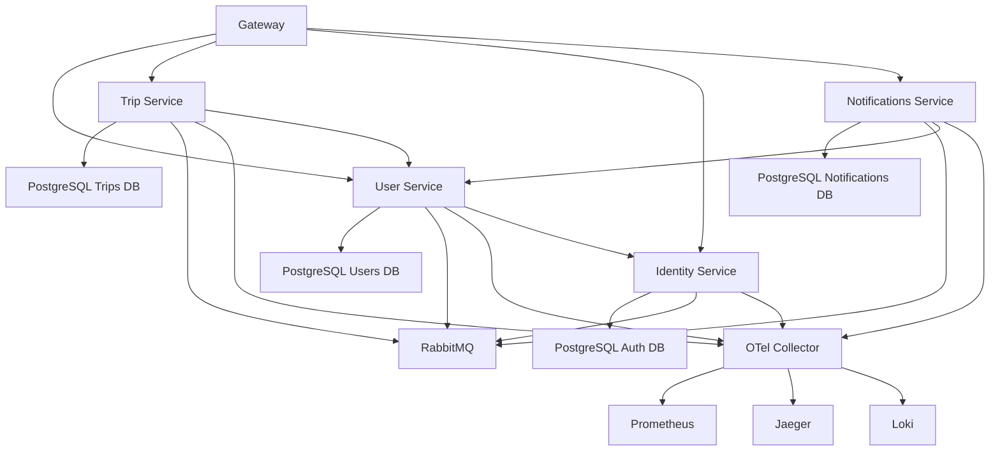

## Overview

This guide covers common issues you may encounter when running Masar Eagle and provides systematic debugging strategies.

## Quick Diagnostics

### Health Check Dashboard

First, check all service health endpoints:

```bash
# Check all services
curl http://localhost:8080/health  # User Service
curl http://localhost:8081/health  # Trip Service
curl http://localhost:8082/health  # Identity Service
curl http://localhost:8083/health  # Notifications Service
curl http://localhost:8084/health  # Gateway
```

### Service Dependencies

Verify the dependency graph (from AppHost.cs):



<Info>
Services use `.WaitFor()` to ensure dependencies are ready before starting.
</Info>

## Common Issues

### Service Won't Start

<AccordionGroup>
  <Accordion title="Database Connection Failed">
    **Symptoms:**
    ```
    Failed to connect to PostgreSQL
    Npgsql.NpgsqlException: connection refused
    ```

    **Diagnosis:**
    ```bash
    # Check PostgreSQL is running
    docker ps | grep postgres
    
    # Check connection string
    docker exec -it postgres psql -U postgres -l
    ```

    **Solution:**
    - Verify PostgreSQL container is running
    - Check connection string format in appsettings.json
    - Ensure databases are created: `users`, `trips`, `notifications`, `auth`
    - Check `POSTGRES_HOST_AUTH_METHOD=trust` environment variable (AppHost.cs:10)
  </Accordion>

  <Accordion title="RabbitMQ Connection Failed">
    **Symptoms:**
    ```
    RabbitMQ.Client.Exceptions.BrokerUnreachableException
    Unable to connect to RabbitMQ
    ```

    **Diagnosis:**
    ```bash
    # Check RabbitMQ is running
    docker ps | grep rabbitmq
    
    # Check management interface
    curl http://localhost:15672
    ```

    **Solution:**
    - Verify RabbitMQ container is running
    - Check username/password parameters (AppHost.cs:18-23)
    - Ensure management plugin is enabled
    - Verify port 5672 (AMQP) and 15672 (Management) are accessible
  </Accordion>

  <Accordion title="OpenTelemetry Collector Unreachable">
    **Symptoms:**
    ```
    Failed to export telemetry
    GRPC connection to otelcollector:4317 failed
    ```

    **Diagnosis:**
    ```bash
    # Check collector is running
    docker ps | grep otelcollector
    
    # Check collector health
    curl http://localhost:13133
    ```

    **Solution:**
    - Verify OTel Collector container is running
    - Check `OTEL_EXPORTER_OTLP_ENDPOINT` environment variable
    - Services must wait for collector: `.WaitFor(otelCollector)` (AppHost.cs:39)
  </Accordion>

  <Accordion title="Port Already in Use">
    **Symptoms:**
    ```
    Failed to bind to address: address already in use
    ```

    **Solution:**
    ```bash
    # Find process using port
    lsof -i :8080
    
    # Kill process or change port in AppHost.cs
    kill -9 <PID>
    ```
  </Accordion>
</AccordionGroup>

### Authentication Errors

<AccordionGroup>
  <Accordion title="401 Unauthorized">
    **Symptoms:**
    - Requests to protected endpoints return 401
    - Error: `UserNotFoundException`

    **Diagnosis:**
    ```bash
    # Test token endpoint
    curl -X POST http://localhost:8080/connect/token \
      -H "Content-Type: application/x-www-form-urlencoded" \
      -d "grant_type=password&username=test&password=test"
    ```

    **Common Causes:**
    - Missing `Authorization` header
    - Expired JWT token
    - Identity service not running
    - JWKS key discovery failed

    **Solution:**
    - Verify Identity service is running and accessible
    - Check service has reference to Identity: `.WithReference(identityApi)` (AppHost.cs:117)
    - Ensure `IDENTITY_KEYS_PATH` is configured (AppHost.cs:97)
    - Check token expiration
  </Accordion>

  <Accordion title="403 Forbidden">
    **Symptoms:**
    - Request authenticated but returns 403
    - Error: `UserForbiddenException`

    **Logged Context:**
    ```json
    {
      "ErrorCategory": "AuthorizationError",
      "UserId": "12345",
      "UserRole": "passenger",
      "RequestPath": "/api/admin/users"
    }
    ```

    **Solution:**
    - Verify user has required role (admin, driver, passenger, company)
    - Check authorization policy in endpoint definition
    - Review user claims in JWT token
  </Accordion>
</AccordionGroup>

### Database Issues

<AccordionGroup>
  <Accordion title="Migration Failed">
    **Symptoms:**
    ```
    Migration failed: relation already exists
    Migration failed: column does not exist
    ```

    **Solution:**
    ```bash
    # Check current migration version
    docker exec -it postgres psql -U postgres -d users \
      -c "SELECT * FROM __EFMigrationsHistory ORDER BY migration_id;"
    
    # Reset database (development only!)
    docker exec -it postgres psql -U postgres -c "DROP DATABASE users;"
    docker exec -it postgres psql -U postgres -c "CREATE DATABASE users;"
    ```

    The service will auto-apply migrations on startup (Program.cs:62-65):
    ```csharp
    builder.Services.AddDatabaseMigrations(
        builder.Configuration,
        Assembly.GetExecutingAssembly(),
        connectionStringName: Components.Database.User);
    ```
  </Accordion>

  <Accordion title="Connection Pool Exhausted">
    **Symptoms:**
    ```
    Timeout expired waiting for connection from pool
    The ConnectionString property has not been initialized
    ```

    **Solution:**
    - Check for unclosed database connections
    - Verify EF Core contexts are properly disposed
    - Increase connection pool size if needed
    - Monitor active connections:
    ```sql
    SELECT count(*) FROM pg_stat_activity WHERE datname = 'users';
    ```
  </Accordion>
</AccordionGroup>

### Message Queue Issues

<AccordionGroup>
  <Accordion title="Messages Not Processed">
    **Symptoms:**
    - Messages sent but not received
    - Queue depth increasing

    **Diagnosis:**
    ```bash
    # Check RabbitMQ management UI
    open http://localhost:15672
    
    # List queues
    docker exec rabbitmq rabbitmqctl list_queues
    ```

    **Wolverine Configuration:**
    Services publish to exchange and listen to queues (Program.cs:136-153):
    ```csharp
    opts.PublishAllMessages().ToRabbitExchange(Components.RabbitMQConfig.ExchangeName);
    
    opts.ListenToRabbitQueue("users-api-queue",
        cfg => cfg.BindExchange(Components.RabbitMQConfig.ExchangeName));
    ```

    **Solution:**
    - Verify queue bindings in RabbitMQ
    - Check message handler registration
    - Review Wolverine outbox for failed messages
    - Ensure Postgres outbox is enabled for transactional messaging
  </Accordion>

  <Accordion title="Outbox Messages Stuck">
    **Symptoms:**
    - Messages stored in outbox but not sent

    **Diagnosis:**
    ```sql
    -- Check outbox table
    SELECT * FROM wolverine.wolverine_outgoing_envelopes 
    WHERE attempts > 0;
    ```

    **Solution:**
    - Verify RabbitMQ is accessible
    - Check Wolverine background service is running
    - Review error logs for serialization issues
  </Accordion>
</AccordionGroup>

### Performance Issues

<AccordionGroup>
  <Accordion title="Slow Response Times">
    **Diagnosis with Tracing:**
    
    <Steps>
      <Step title="Open Jaeger UI">
        Navigate to http://localhost:16686
      </Step>
      
      <Step title="Find Slow Trace">
        - Select service (user, trip, gateway)
        - Set min duration filter (e.g., >1s)
        - Search for traces
      </Step>
      
      <Step title="Analyze Spans">
        - Database queries
        - HTTP client calls
        - Message processing
        - Middleware overhead
      </Step>
    </Steps>

    **Common Causes:**
    - N+1 query problem
    - Missing database indexes
    - Slow external API calls
    - Large payload serialization

    **Solution:**
    - Add eager loading: `.Include()`
    - Create database indexes
    - Add HTTP client timeout
    - Enable response compression (already configured)
  </Accordion>

  <Accordion title="High Memory Usage">
    **Diagnosis:**
    ```bash
    # Check container memory
    docker stats --no-stream
    
    # Query runtime metrics
    curl http://localhost:9090/api/v1/query?query=process_runtime_dotnet_gc_heap_size_bytes
    ```

    **Metrics to Monitor:**
    - `process_runtime_dotnet_gc_heap_size_bytes`
    - `process_runtime_dotnet_gc_collections_count`
    - `process_working_set_bytes`

    **Solution:**
    - Check for memory leaks (unclosed streams, event handlers)
    - Review object pooling usage
    - Monitor Gen 2 GC collections
    - Adjust GC settings if needed
  </Accordion>

  <Accordion title="Thread Pool Starvation">
    **Symptoms:**
    ```
    Tasks queuing up
    ThreadPool.GetAvailableThreads shows low count
    ```

    **Solution:**
    - Ensure all I/O operations are async
    - Avoid `Task.Wait()` or `.Result`
    - Use `await` consistently
    - Review Hangfire worker count (Trips.Api Program.cs:121-125):
    ```csharp
    builder.Services.AddHangfireServer(options =>
    {
        options.WorkerCount = Environment.ProcessorCount * 5;
    });
    ```
  </Accordion>
</AccordionGroup>

## Debugging Strategies

### Error ID Correlation

Every error gets a unique 16-character ID (GlobalExceptionMiddleware.cs:49):

```csharp
string errorId = Guid.NewGuid().ToString("N")[..16].ToUpperInvariant();
```

**Find error in logs:**
```logql
{service_name=~".*"} | json | ErrorId="A1B2C3D4E5F6G7H8"
```

**Find related traces:**
```bash
# In Jaeger, search for tag: error.id=A1B2C3D4E5F6G7H8
```

### Request Tracing

Every gateway request gets an `X-Request-Id` header (RequestResponseLoggingMiddleware.cs:17-21):

```csharp
string requestId = GenerateRequestId(context);
context.Response.Headers["X-Request-Id"] = requestId;
```

**Trace request across services:**
```logql
{service_name=~".*"} |= "req_abc123def456"
```

### Enable Detailed Logging

<Tabs>
  <Tab title="Environment Variable">
    ```bash
    export LOGGING__LOGLEVEL__DEFAULT=Debug
    export LOGGING__LOGLEVEL__MICROSOFT_ASPNETCORE=Information
    ```
  </Tab>
  
  <Tab title="appsettings.Development.json">
    ```json
    {
      "Logging": {
        "LogLevel": {
          "Default": "Debug",
          "Microsoft.AspNetCore": "Information",
          "Microsoft.EntityFrameworkCore.Database.Command": "Information"
        }
      }
    }
    ```
  </Tab>
</Tabs>

### SQL Query Logging

Enable EF Core query logging:

```json
{
  "Logging": {
    "LogLevel": {
      "Microsoft.EntityFrameworkCore.Database.Command": "Information"
    }
  }
}
```

Queries will appear in logs:
```
Executed DbCommand (123ms) [Parameters=[@p0='?' (DbType = Int32)], CommandType='Text']
SELECT * FROM users WHERE id = @p0
```

### HTTP Client Logging

Enable HTTP client request/response logging:

```json
{
  "Logging": {
    "LogLevel": {
      "System.Net.Http.HttpClient": "Information"
    }
  }
}
```

## Monitoring Alerts

### Recommended Prometheus Alerts

<CodeGroup>
```yaml High Error Rate
- alert: HighErrorRate
  expr: |
    rate(errors_total{is_client_error="false"}[5m]) > 0.05
  for: 5m
  annotations:
    summary: "High server error rate on {{ $labels.service }}"
```

```yaml High Latency
- alert: HighLatency
  expr: |
    histogram_quantile(0.95, 
      rate(http_server_request_duration_seconds_bucket[5m])
    ) > 1.0
  for: 5m
  annotations:
    summary: "95th percentile latency above 1s"
```

```yaml Database Connection Issues
- alert: DatabaseConnectionPoolExhausted
  expr: |
    npgsql_connection_pools_max_connections - 
    npgsql_connection_pools_num_connections < 5
  annotations:
    summary: "Database connection pool nearly exhausted"
```

```yaml Service Down
- alert: ServiceDown
  expr: up{job=~"user|trip|gateway"} == 0
  for: 1m
  annotations:
    summary: "Service {{ $labels.job }} is down"
```
</CodeGroup>

## Error Response Format

All errors follow RFC 7807 Problem Details format (GlobalExceptionMiddleware.cs:57-90):

```json
{
  "type": "https://tools.ietf.org/html/rfc7231#section-6.6.1",
  "title": "An unexpected error occurred",
  "detail": "Invalid operation",
  "status": 500,
  "instance": "/api/trips/123",
  "errorId": "A1B2C3D4E5F6G7H8",
  "timestamp": "2024-01-15T10:30:00.000Z",
  "exceptionType": "System.InvalidOperationException",  // Development only
  "stackTrace": "...",  // Development only
  "source": "Trips.Api"  // Development only
}
```

## Getting Help

<CardGroup cols={2}>
  <Card title="Check Logs" icon="file-lines">
    Start with structured logs in Grafana:
    ```logql
    {service_name=~".*"} | json | level="error"
    ```
  </Card>

  <Card title="Check Traces" icon="diagram-project">
    Use Jaeger to trace request flow:
    http://localhost:16686
  </Card>

  <Card title="Check Metrics" icon="chart-line">
    Review service metrics in Grafana:
    http://localhost:3000
  </Card>

  <Card title="Review Configuration" icon="gear">
    Verify environment variables and appsettings.json
  </Card>
</CardGroup>

## Next Steps

<CardGroup cols={2}>
  <Card title="Monitoring" icon="chart-line" href="./monitoring">
    Set up comprehensive monitoring
  </Card>
  <Card title="Scaling" icon="arrows-up-down" href="./scaling">
    Performance tuning and scaling considerations
  </Card>
</CardGroup>