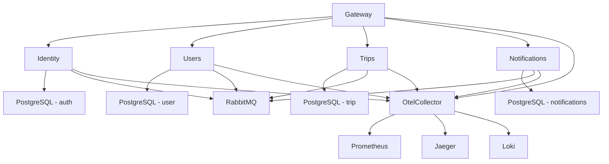

## Overview

.NET Aspire provides cloud-ready orchestration for microservices. This guide covers production deployment using Aspire's publishing capabilities, which generates container manifests and deployment configurations.

<Note>
  .NET Aspire 13.0.2+ is required for Masar Eagle deployment.
</Note>

## Why Aspire Deployment?

<CardGroup cols={2}>
  <Card title="Service Discovery" icon="compass">
    Automatic service discovery and registration without hardcoded URLs
  </Card>
  
  <Card title="Health Management" icon="heart-pulse">
    Built-in health checks and automatic dependency management
  </Card>
  
  <Card title="Observability" icon="chart-mixed">
    Integrated OpenTelemetry with distributed tracing and metrics
  </Card>
  
  <Card title="Environment Parity" icon="equals">
    Same orchestration in development and production
  </Card>
</CardGroup>

## Aspire Architecture

### AppHost Configuration

The AppHost (`src/aspire/AppHost/AppHost.cs`) defines the entire application topology:

```csharp AppHost.cs
using AppHost.OpenTelemetryCollector;
using Projects;

IDistributedApplicationBuilder builder = DistributedApplication.CreateBuilder(args);

// Docker Compose environment
builder.AddDockerComposeEnvironment("env")
    .WithDashboard(dashboard => dashboard.WithHostPort(8080));

// PostgreSQL with 4 databases
var postgres = builder.AddPostgres("postgres")
    .WithEnvironment("POSTGRES_HOST_AUTH_METHOD", "trust")
    .WithDataVolume("masar-postgres-data")
    .WithPgAdmin(pgAdmin => pgAdmin.WithHostPort(5050));

var usersDb = postgres.AddDatabase("user");
var tripsDb = postgres.AddDatabase("trip");
var notificationsDb = postgres.AddDatabase("notifications");
var authDb = postgres.AddDatabase("auth");

// RabbitMQ with management plugin
var username = builder.AddParameter("username", secret: true);
var password = builder.AddParameter("password", secret: true);

var rabbitmq = builder.AddRabbitMQ("rabbitmq", username, password)
    .WithDataVolume("rabbitmq-data")
    .WithManagementPlugin();

// OpenTelemetry Collector
var otelCollector = builder.AddOpenTelemetryCollector(
    "otelcollector", 
    "../otelcollector/config.yaml"
);

string otelEndpoint = "http://otelcollector:4317";

// Services with dependencies
var usersApi = builder.AddProject<User>("user")
    .WithReference(usersDb)
    .WithReference(rabbitmq)
    .WithEnvironment("OTEL_EXPORTER_OTLP_ENDPOINT", otelEndpoint)
    .WithExternalHttpEndpoints()
    .WaitFor(usersDb)
    .WaitFor(rabbitmq);

// ... Additional services configured similarly

await builder.Build().RunAsync();
```

### Service Dependencies Graph



## Publishing for Production

### Generate Deployment Manifest

<Steps>
  <Step title="Navigate to AppHost">
    ```bash
    cd src/aspire/AppHost
    ```
  </Step>
  
  <Step title="Generate Manifest">
    ```bash
    # Generate deployment manifest
    dotnet run --publisher manifest --output-path ./manifest.json
    
    # View generated manifest
    cat manifest.json | jq
    ```
    
    The manifest contains:
    - Service definitions
    - Container images
    - Environment variables
    - Volume mounts
    - Network configuration
  </Step>
  
  <Step title="Generate Docker Compose">
    ```bash
    # Publish to Docker Compose format
    dotnet publish \
      --os linux \
      --arch x64 \
      /p:PublishProfile=DefaultContainer \
      --output ../../../deploy
    ```
    
    This generates:
    - `docker-compose.yml`
    - `docker-compose.override.yml`
    - Container configurations
  </Step>
</Steps>

### Build Container Images

<Tabs>
  <Tab title="Docker Build">
    ```bash
    # Build all service images
    cd src/services
    
    # Identity
    docker build -t masar-eagle/identity:latest \
      -f Identity/Dockerfile .
    
    # Users
    docker build -t masar-eagle/users:latest \
      -f Users/Dockerfile .
    
    # Trips
    docker build -t masar-eagle/trips:latest \
      -f Trips/Dockerfile .
    
    # Notifications
    docker build -t masar-eagle/notifications:latest \
      -f Notifications/Dockerfile .
    
    # Gateway
    docker build -t masar-eagle/gateway:latest \
      -f Gateway/Dockerfile .
    ```
  </Tab>
  
  <Tab title="Aspire Publish">
    ```bash
    # Let Aspire build containers automatically
    cd src/aspire/AppHost
    
    dotnet publish \
      /p:PublishProfile=DefaultContainer \
      --os linux \
      --arch x64
    
    # Images are built with naming convention:
    # {project-name}:latest
    ```
  </Tab>
  
  <Tab title="CI/CD Pipeline">
    ```yaml .github/workflows/build.yml
    name: Build Images
    
    on:
      push:
        branches: [main]
    
    jobs:
      build:
        runs-on: ubuntu-latest
        steps:
          - uses: actions/checkout@v4
          
          - name: Set up .NET
            uses: actions/setup-dotnet@v4
            with:
              dotnet-version: '10.0.x'
          
          - name: Build with Aspire
            run: |
              cd src/aspire/AppHost
              dotnet publish \
                /p:PublishProfile=DefaultContainer \
                --os linux --arch x64
          
          - name: Push to Registry
            run: |
              docker tag identity:latest ${{ secrets.REGISTRY }}/identity:${{ github.sha }}
              docker push ${{ secrets.REGISTRY }}/identity:${{ github.sha }}
    ```
  </Tab>
</Tabs>

## Deployment Methods

### Method 1: Docker Compose (Recommended)

<Steps>
  <Step title="Generate Compose Files">
    ```bash
    cd src/aspire/AppHost
    dotnet publish --output ../../../deploy
    ```
  </Step>
  
  <Step title="Configure Environment">
    ```bash
    cd deploy
    cp .env.example .env
    
    # Edit .env with production values
    nano .env
    ```
  </Step>
  
  <Step title="Deploy">
    ```bash
    # Deploy to production
    docker compose up -d
    
    # Check status
    docker compose ps
    
    # View logs
    docker compose logs -f
    ```
  </Step>
</Steps>

### Method 2: Kubernetes

<Steps>
  <Step title="Generate Kubernetes Manifests">
    ```bash
    # Install Aspire Kubernetes extension
    dotnet add package Aspire.Hosting.Kubernetes
    
    # Generate manifests
    cd src/aspire/AppHost
    dotnet run --publisher kubernetes --output-path ./k8s
    ```
  </Step>
  
  <Step title="Review Manifests">
    ```bash
    ls k8s/
    # deployment-gateway.yaml
    # deployment-identity.yaml
    # deployment-users.yaml
    # deployment-trips.yaml
    # deployment-notifications.yaml
    # service-*.yaml
    # configmap-*.yaml
    # secret-*.yaml
    ```
  </Step>
  
  <Step title="Deploy to Kubernetes">
    ```bash
    # Create namespace
    kubectl create namespace masar-eagle
    
    # Apply manifests
    kubectl apply -f k8s/ -n masar-eagle
    
    # Check deployment
    kubectl get pods -n masar-eagle
    kubectl get services -n masar-eagle
    ```
  </Step>
</Steps>

### Method 3: Azure Container Apps

<Steps>
  <Step title="Install Azure Tools">
    ```bash
    # Install Azure CLI
    curl -sL https://aka.ms/InstallAzureCLIDeb | sudo bash
    
    # Install Aspire Azure extension
    az extension add --name containerapp
    ```
  </Step>
  
  <Step title="Generate Azure Configuration">
    ```bash
    cd src/aspire/AppHost
    
    # Generate Azure Container Apps manifest
    dotnet run --publisher azd --output-path ./azure
    ```
  </Step>
  
  <Step title="Deploy to Azure">
    ```bash
    cd azure
    
    # Login to Azure
    az login
    
    # Deploy
    azd up
    ```
  </Step>
</Steps>

## Production Configuration

### AppHost Parameters

Configure AppHost for production:

```json appsettings.Production.json
{
  "Logging": {
    "LogLevel": {
      "Default": "Warning",
      "Microsoft.AspNetCore": "Warning",
      "Aspire.Hosting": "Information"
    }
  },
  "Parameters": {
    "username": "${RABBITMQ_USERNAME}",
    "password": "${RABBITMQ_PASSWORD}"
  },
  "Dashboard": {
    "Enabled": false
  }
}
```

<Warning>
  Disable the Aspire Dashboard in production or protect it with authentication.
</Warning>

### Environment Variables

Set production environment variables:

```bash
# Application Environment
export ASPNETCORE_ENVIRONMENT=Production
export DOTNET_ENVIRONMENT=Production

# RabbitMQ Credentials
export RABBITMQ_USERNAME=masar-eagle-prod
export RABBITMQ_PASSWORD=$(openssl rand -base64 32)

# PostgreSQL
export POSTGRES_PASSWORD=$(openssl rand -base64 32)

# JWT Secret
export JWT_SECRET=$(openssl rand -base64 64)

# External Services
export TAQNYAT_BEARER_TOKEN=your-production-token
export MOYASAR_SECRET_KEY=sk_live_xxx
export FIREBASE_CREDENTIALS=/run/secrets/firebase-credentials
```

### SSL/TLS Configuration

Enable HTTPS for production:

```csharp AppHost.cs
// Production HTTPS configuration
if (builder.Environment.IsProduction())
{
    gatewayApi.WithEnvironment("ASPNETCORE_URLS", "https://+:443;http://+:80")
        .WithEnvironment("ASPNETCORE_Kestrel__Certificates__Default__Path", "/app/certs/cert.pem")
        .WithEnvironment("ASPNETCORE_Kestrel__Certificates__Default__KeyPath", "/app/certs/key.pem");
}
```

## Deployment Script

The included `deploy.sh` script simplifies Aspire deployments:

```bash deploy.sh
#!/bin/bash
# Masar Eagle Aspire Deployment Script

set -e

ENVIRONMENT=$1
DEPLOY_DIR="/opt/masar-eagle"

if [ "$ENVIRONMENT" = "dev" ]; then
    APP_DIR="$DEPLOY_DIR/dev"
    COMPOSE_PROJECT_NAME="dev"
elif [ "$ENVIRONMENT" = "prod" ]; then
    APP_DIR="$DEPLOY_DIR/prod"
    COMPOSE_PROJECT_NAME="prod"
else
    echo "Usage: $0 {dev|prod}"
    exit 1
fi

echo "🚀 Deploying to $ENVIRONMENT environment..."

# Create deployment directory
mkdir -p "$APP_DIR"
cd "$APP_DIR"

# Ensure Docker network exists
if ! docker network inspect npm-network >/dev/null 2>&1; then
    echo "➕ Creating docker network: npm-network"
    docker network create npm-network
fi

# Ensure volumes exist
for volume in dashboard-data identity-keys masar-postgres-data rabbitmq-data; do
    VOLUME_NAME="${COMPOSE_PROJECT_NAME}_${volume}"
    if ! docker volume inspect "$VOLUME_NAME" >/dev/null 2>&1; then
        echo "➕ Creating volume: $VOLUME_NAME"
        docker volume create "$VOLUME_NAME"
    else
        echo "✅ Volume exists: $VOLUME_NAME"
    fi
done

# Pull and deploy
echo "🔄 Updating containers (keeping data volumes)..."
docker compose -p "$COMPOSE_PROJECT_NAME" up -d --pull always --no-build

# Run post-deploy scripts
if [ -x "$(pwd)/scripts/post_deploy_fix.sh" ]; then
    echo "🔧 Running post-deploy fix script"
    scripts/post_deploy_fix.sh "$COMPOSE_PROJECT_NAME" "$(pwd)" || true
fi

# Initialize volumes
if [ -x "$(pwd)/scripts/init-volumes.sh" ]; then
    echo "📁 Initializing volumes"
    scripts/init-volumes.sh "$COMPOSE_PROJECT_NAME" "user" || true
    scripts/init-volumes.sh "$COMPOSE_PROJECT_NAME" "trip" || true
fi

# Fix permissions
if [ -x "$(pwd)/scripts/fix-upload-permissions.sh" ]; then
    echo "🔧 Fixing upload permissions"
    scripts/fix-upload-permissions.sh "$COMPOSE_PROJECT_NAME" "user" || true
fi

echo "✅ Deployment complete!"
docker compose -p "$COMPOSE_PROJECT_NAME" ps

echo ""
echo "📋 Recent logs:"
docker compose -p "$COMPOSE_PROJECT_NAME" logs --tail=50
```

### Usage

<Tabs>
  <Tab title="Development">
    ```bash
    chmod +x deploy.sh
    ./deploy.sh dev
    ```
  </Tab>
  
  <Tab title="Production">
    ```bash
    chmod +x deploy.sh
    ./deploy.sh prod
    ```
  </Tab>
</Tabs>

## Monitoring and Observability

### Built-in Telemetry

Aspire automatically configures OpenTelemetry for all services:

```csharp
// Configured in AppHost.cs
services.WithEnvironment("OTEL_EXPORTER_OTLP_ENDPOINT", "http://otelcollector:4317")
    .WithEnvironment("OTEL_EXPORTER_OTLP_PROTOCOL", "grpc")
    .WithEnvironment("OTEL_SERVICE_NAME", serviceName);
```

### Monitoring Stack

The AppHost configures a complete observability stack:

<AccordionGroup>
  <Accordion title="Prometheus - Metrics Collection">
    ```csharp
    var prometheus = builder.AddContainer("prometheus", "prom/prometheus", "v3.2.1")
        .WithBindMount("../prometheus", "/etc/prometheus")
        .WithArgs("--web.enable-otlp-receiver", "--config.file=/etc/prometheus/prometheus.yml")
        .WithHttpEndpoint(targetPort: 9090, name: "http");
    ```
    
    Access at: http://localhost:9090
  </Accordion>
  
  <Accordion title="Grafana - Visualization">
    ```csharp
    var grafana = builder.AddContainer("grafana", "grafana/grafana")
        .WithBindMount("../grafana/config", "/etc/grafana")
        .WithBindMount("../grafana/dashboards", "/var/lib/grafana/dashboards")
        .WithEnvironment("PROMETHEUS_ENDPOINT", prometheus.GetEndpoint("http"))
        .WithEnvironment("LOKI_ENDPOINT", loki.GetEndpoint("http"))
        .WithEnvironment("JAEGER_ENDPOINT", jaeger.GetEndpoint("http"))
        .WithHttpEndpoint(targetPort: 3000, name: "http");
    ```
    
    Access at: http://localhost:3000
  </Accordion>
  
  <Accordion title="Jaeger - Distributed Tracing">
    ```csharp
    var jaeger = builder.AddContainer("jaeger", "jaegertracing/jaeger")
        .WithBindMount("../jaeger/config.yaml", "/jaeger/config.yaml")
        .WithEndpoint(port: 16686, targetPort: 16686, scheme: "http", name: "http")
        .WithEndpoint(port: 4317, targetPort: 4317, name: "grpc-collector");
    ```
    
    Access at: http://localhost:16686
  </Accordion>
  
  <Accordion title="Loki - Log Aggregation">
    ```csharp
    var loki = builder.AddContainer("loki", "grafana/loki:latest")
        .WithBindMount("../loki/config.yaml", "/etc/loki/config.yaml")
        .WithHttpEndpoint(targetPort: 3100, name: "http")
        .WithArgs("-config.file=/etc/loki/config.yaml");
    ```
    
    Query via Grafana Explore
  </Accordion>
</AccordionGroup>

### Access Monitoring

```bash
# Prometheus
curl http://localhost:9090/api/v1/query?query=up

# Grafana (default: admin/admin)
open http://localhost:3000

# Jaeger
open http://localhost:16686
```

## Database Management

### pgAdmin Access

Aspire configures pgAdmin for database management:

```csharp
var postgres = builder.AddPostgres("postgres")
    .WithDataVolume("masar-postgres-data")
    .WithPgAdmin(pgAdmin => pgAdmin.WithHostPort(5050));
```

Access: http://localhost:5050

### Database Initialization

Databases are created automatically:

```csharp
// Four separate databases
var usersDb = postgres.AddDatabase("user");
var tripsDb = postgres.AddDatabase("trip");
var notificationsDb = postgres.AddDatabase("notifications");
var authDb = postgres.AddDatabase("auth");
```

Each service references its database:

```csharp
builder.AddProject<User>("user")
    .WithReference(usersDb)  // Connection string injected
    .WaitFor(usersDb);        // Wait for database to be ready
```

## Service Discovery

### Automatic Service Resolution

Aspire provides automatic service discovery:

```csharp
// Gateway references services
builder.AddProject<Gateway>("gateway")
    .WithReference(usersApi)
    .WithReference(tripsApi)
    .WithReference(notificationsApi)
    .WithReference(identityApi);
```

Services are accessible by name:
- `http://user:8080`
- `http://trip:8080`
- `http://notifications:8080`
- `http://identity:8080`

### YARP Integration

The Gateway uses YARP with service discovery:

```json appsettings.json
{
  "ReverseProxy": {
    "Clusters": {
      "users-cluster": {
        "Destinations": {
          "destination1": {
            "Address": "http://user:8080"
          }
        }
      }
    }
  }
}
```

Aspire resolves service names automatically.

## Health Checks

### Service Health

All services include health checks:

```bash
# Check all services via Aspire Dashboard
open http://localhost:8080

# Check individual service
curl http://localhost:8080/health
```

### Dependency Health

Services wait for dependencies:

```csharp
builder.AddProject<User>("user")
    .WithReference(usersDb)
    .WithReference(rabbitmq)
    .WaitFor(usersDb)      // Wait for database
    .WaitFor(rabbitmq)     // Wait for RabbitMQ
    .WaitFor(otelCollector); // Wait for telemetry
```

## Scaling

### Horizontal Scaling

Scale services using replicas:

```csharp
// Add replicas in AppHost.cs
builder.AddProject<User>("user")
    .WithReplicas(3);  // Run 3 instances
```

Or scale with Docker Compose:

```bash
docker compose up -d --scale user=3 --scale trip=3
```

### Load Balancing

Add a load balancer:

```csharp
var nginx = builder.AddContainer("nginx", "nginx:alpine")
    .WithBindMount("./nginx.conf", "/etc/nginx/nginx.conf")
    .WithHttpEndpoint(targetPort: 80);
```

## Security Best Practices

<AccordionGroup>
  <Accordion title="Secrets Management">
    Use Aspire parameters for secrets:
    
    ```csharp
    var jwtSecret = builder.AddParameter("jwt-secret", secret: true);
    var dbPassword = builder.AddParameter("db-password", secret: true);
    
    builder.AddProject<Identity>("identity")
        .WithEnvironment("Jwt__SecretKey", jwtSecret);
    ```
    
    Provide secrets at runtime:
    ```bash
    dotnet run --jwt-secret "your-secret" --db-password "your-password"
    ```
  </Accordion>
  
  <Accordion title="Network Isolation">
    Services communicate on internal networks:
    
    ```csharp
    // Only Gateway exposes external endpoints
    builder.AddProject<Gateway>("gateway")
        .WithExternalHttpEndpoints();
    
    // Internal services not exposed
    builder.AddProject<User>("user")
        .WithoutExternalHttpEndpoints();
    ```
  </Accordion>
  
  <Accordion title="HTTPS Enforcement">
    ```csharp
    builder.AddProject<Gateway>("gateway")
        .WithEnvironment("ASPNETCORE_URLS", "https://+:443")
        .WithEnvironment("ASPNETCORE_HTTPS_PORT", "443");
    ```
  </Accordion>
</AccordionGroup>

## Troubleshooting

<AccordionGroup>
  <Accordion title="Aspire Dashboard Not Starting">
    ```bash
    # Check Aspire logs
    cd src/aspire/AppHost
    dotnet run
    
    # Verify port availability
    lsof -i :8080
    
    # Change dashboard port
    builder.AddDockerComposeEnvironment("env")
        .WithDashboard(d => d.WithHostPort(8081));
    ```
  </Accordion>
  
  <Accordion title="Service Discovery Issues">
    ```bash
    # Verify service registration
    docker exec gateway-1 nslookup user
    
    # Check Aspire dashboard for service status
    open http://localhost:8080
    ```
  </Accordion>
  
  <Accordion title="Container Image Issues">
    ```bash
    # Rebuild images
    docker compose build --no-cache
    
    # Pull latest base images
    docker pull mcr.microsoft.com/dotnet/aspire-dashboard:13.0
    ```
  </Accordion>
</AccordionGroup>

## Migration from Development to Production

<Steps>
  <Step title="Update AppHost Configuration">
    ```csharp
    if (builder.ExecutionContext.IsPublishMode)
    {
        // Production-specific configuration
        gatewayApi.WithEnvironment("ASPNETCORE_ENVIRONMENT", "Production");
    }
    ```
  </Step>
  
  <Step title="Generate Production Manifests">
    ```bash
    cd src/aspire/AppHost
    dotnet publish --output ../../../deploy/prod
    ```
  </Step>
  
  <Step title="Configure Secrets">
    ```bash
    # Create .env file
    cd deploy/prod
    cp .env.example .env
    
    # Edit with production values
    nano .env
    ```
  </Step>
  
  <Step title="Deploy">
    ```bash
    ./deploy.sh prod
    ```
  </Step>
</Steps>

## Next Steps

<CardGroup cols={3}>
  <Card title="Monitoring" icon="chart-line" href="/operations/monitoring">
    Set up alerts and dashboards
  </Card>
  
  <Card title="Backup Strategy" icon="database" href="/operations/troubleshooting">
    Configure automated backups
  </Card>
  
  <Card title="Scaling" icon="arrows-split-up-and-left" href="/operations/scaling">
    Learn about scaling strategies
  </Card>
</CardGroup>

## Additional Resources

<CardGroup cols={2}>
  <Card title=".NET Aspire Documentation" icon="book" href="https://learn.microsoft.com/en-us/dotnet/aspire/">
    Official .NET Aspire documentation
  </Card>
  
  <Card title="Aspire Hosting Packages" icon="box" href="https://learn.microsoft.com/en-us/dotnet/aspire/fundamentals/hosting">
    Learn about hosting integrations
  </Card>
</CardGroup>